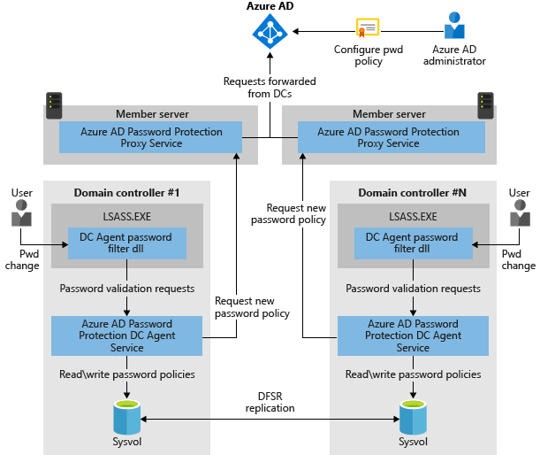

# Preview: Enforce Azure AD password protection for Windows Server Active Directory

|     |
| --- |
| Azure AD password protection and the custom banned password list are public preview features of Azure Active Directory. For more information about previews, see  [Supplemental Terms of Use for Microsoft Azure Previews](https://azure.microsoft.com/support/legal/preview-supplemental-terms/)|
|     |

Azure AD password protection is a new feature in public preview powered by Azure Active Directory (Azure AD) to enhance password policies in an organization. The on-premises deployment of Azure AD password protection uses both the global and custom banned password lists stored in Azure AD, and performs the same checks on-premises as Azure AD cloud-based changes.

There are three software components that make up Azure AD password protection:

* The Azure AD password protection proxy service runs on any domain-joined machine in the current Active Directory forest. It forwards requests from domain controllers to Azure AD and returns the response from Azure AD back to the domain controller.
* The Azure AD password protection DC agent service receives password validation requests from the DC Agent password filter dll, processes them using the current locally available password policy, and returns the result (pass\fail). This service is responsible for periodically (once per hour) calling the Azure AD password protection proxy service to retrieve new versions of the password policy. Communication for calls to and from the Azure AD password protection proxy service is handled over RPC (Remote Procedure Call) over TCP. Upon retrieval, new policies are stored in a sysvol folder where they can replicate to other domain controllers. The DC agent service also monitors the sysvol folder for changes in case other domain controllers have written new password policies there, if a suitably recent policy already is available the check of the Azure AD password protection proxy service will be skipped.
* The DC Agent password filter dll receives password validation requests from the operating system and forwards them to the Azure AD password protection DC agent service running locally on the domain controller.

## Requirements

* All machines where Azure AD password protection components are installed including domain controllers must be running Windows Server 2012 or later.
* All machines where Azure AD password protection components are installed including domain controllers must have the Universal C runtime installed. This is preferably accomplished by fully patching the machine via Windows Update. Otherwise an appropriate OS-specific update package may be installed - see [Update for Universal C Runtime in Windows](https://support.microsoft.com/en-us/help/2999226/update-for-universal-c-runtime-in-windows)
* Network connectivity must exist between at least one domain controller in each domain and at least one server hosting the Azure AD password protection proxy service.
* Any Active Directory domain running the DC agent service software must use DFSR for sysvol replication.
* A global administrator account to register the Azure AD password protection proxy service with Azure AD.
* An account with Active Directory domain administrator privileges in the forest root domain.

### License requirements

The benefits of the global banned password list apply to all users of Azure Active Directory (Azure AD).

The custom banned password list requires Azure AD Basic licenses.

Azure AD password protection for Windows Server Active Directory requires Azure AD Premium licenses.

Additional licensing information, including costs, can be found on the [Azure Active Directory pricing site](https://azure.microsoft.com/pricing/details/active-directory/).

## Download

There are two required installers for Azure AD password protection that can be downloaded from the [Microsoft download center](https://www.microsoft.com/download/details.aspx?id=57071)

## Answers to common questions

* No internet connectivity required from the domain controllers. The machine(s) running the Azure AD password protection proxy service are the only machines requiring internet connectivity.
* No network ports are opened on domain controllers.
* No Active Directory schema changes are required.
* The software uses the existing Active Directory container and serviceConnectionPoint schema objects.
* There is no minimum Active Directory Domain or Forest Functional level (DFL\FFL) requirement.
* The software does not create or require any accounts in the Active Directory domains it protects.
* Incremental deployment is supported with the tradeoff that password policy is only enforced where the domain controller agent is installed.
* Azure AD password protection is not a real-time policy application engine. There may be a delay in the time between a password policy configuration change and the time it reaches and is enforced on all domain controllers.

## Next steps

[Deploy Azure AD password protection](howto-password-ban-bad-on-premises.md)