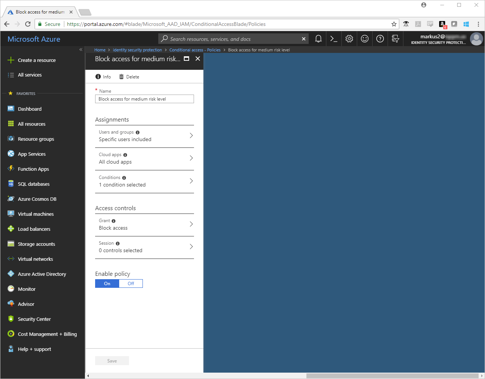
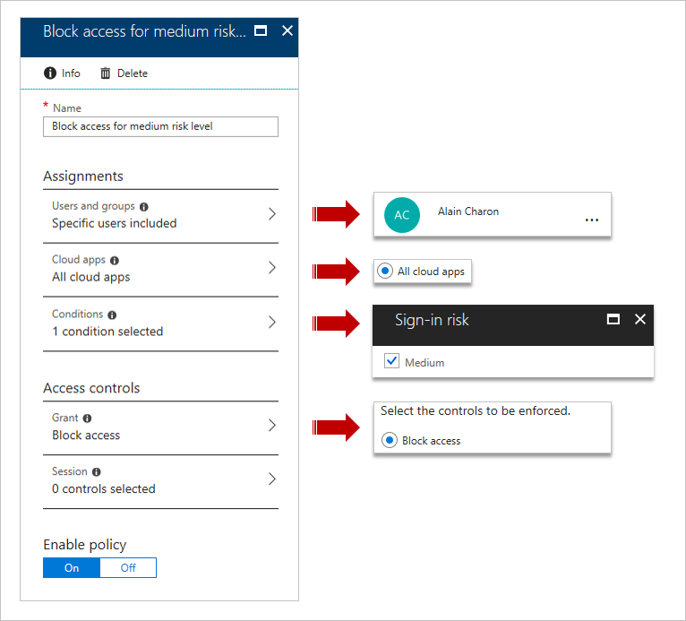
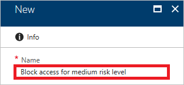
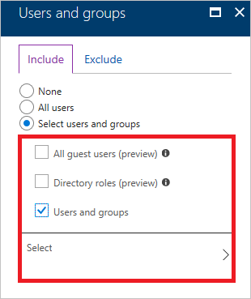
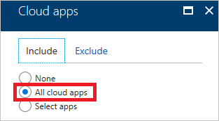
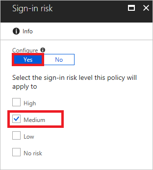
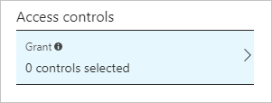
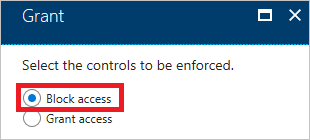
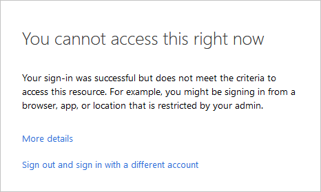

# Quickstart: Block access when a session risk is detected with Azure Active Directory conditional access  

To keep your environment protected, you might want to block suspicious users from signing insign-in activity. [Azure Active Directory (Azure AD) Identity Protection](../active-directory-identityprotection.md) analyzes each sign-in and calculates the likelihood that a sign-in attempt was not performed by the legitimate owner of a user account. The likelihood (low, medium, high) is indicated in form of a calculated value called [sign-in risk levels](conditions.md#sign-in-risk). By setting the sign-in risk condition, you can configure a conditional access policy to respond to specific sign-in risk levels. 

This quickstart shows how to configure a [conditional access policy](../active-directory-conditional-access-azure-portal.md) that blocks a sign-in when a configured sign-in risk level has been detected. 

If you don't have an Azure subscription, create a [free account](https://azure.microsoft.com/free/?WT.mc_id=A261C142F) before you begin.

## Prerequisites 

To complete the scenario in this tutorial, you need:

- **Access to an Azure AD Premium P2 edition** - While conditional access is an Azure AD Premium P1 capability, you need a P2 edition because the scenario in this quickstart requires Identity Protection. 

- **Identity Protection** - The scenario in this quickstart requires Identity Protection to be enabled. If you don't know how to enable Identity Protection, see [Enabling Azure Active Directory Identity Protection](../active-directory-identityprotection-enable.md).

- **Tor Browser** - The [Tor Browser](https://www.torproject.org/projects/torbrowser.html.en) is designed to help you preserve your privacy online. Identity Protection detects a sign-in from a Tor Browser as **sign-ins from anonymous IP addresses**, which has a medium risk level. For more information, see [Azure Active Directory risk events](../active-directory-reporting-risk-events.md).  

- **A test account called Alain Charon** - If you don't know how to create a test account, see [Add cloud-based users](../fundamentals/add-users-azure-active-directory.md#add-cloud-based-users).

## Test your sign-in 

The goal of this step is to make sure that your test account can access your tenant using the Tor Browser.

**To test your sign-in:**

1. Sign in to your [Azure portal](https://portal.azure.com) as **Alain Charon**.

2. Sign out. 

## Create your conditional access policy 

The scenario in this quickstart uses a sign-in from a Tor Browser to generate a detected **Sign-ins from anonymous IP addresses** risk event. The risk level of this risk event is medium. To respond to this risk event, you set the sign-in risk condition to medium. In a production environment, you should set the sign-in risk condition either to high or to medium and high.     

This section shows how to create the required conditional access policy. In your policy, set:

|Setting |Value|
|---     | --- |
| Users and groups | Alain Charon  |
| Cloud apps | All cloud apps |
| Sign-in risk | Medium |
| Grant | Block access |
 

 

**To configure your conditional access policy:**

1. Sign in to your [Azure portal](https://portal.azure.com) as global administrator, security administrator, or a conditional access administrator.

2. In the Azure portal, on the left navbar, click **Azure Active Directory**. 

    

3. On the **Azure Active Directory** page, in the **Manage** section, click **Conditional access**.

    
 
4. On the **Conditional Access** page, in the toolbar on the top, click **Add**.

    

5. On the **New** page, in the **Name** textbox, type **Block access for medium risk level**.

    

6. In the **Assignment** section, click **Users and groups**.

    

7. On the **Users and groups** page:

    

    a. Click **Select users and groups**, and then select **Users and groups**.

    b. Click **Select**.

    c. On the **Select** page, select **Alain Charon**, and then click **Select**.

    d. On the **Users and groups** page, click **Done**.

8. Click **Cloud apps**.

    

9. On the **Cloud apps** page:

    

    a. Click **All cloud apps**.

    b. Click **Done**.

10. Click **Conditions**. 

    

11. On the **Conditions** page:

    

    a. Click **Sign-in risk**.
 
    b. As **Configure**, click **Yes**.

    c. As sign-in risk level, select **Medium**.

    d. Click **Select**.

    e. On the **Conditions** page, click **Done**.

10. In the **Access controls** section, click **Grant**.

    

11. On the **Grant** page:

    

    a. Select **Block access**.

    b. Click **Select**.

12. In the **Enable policy** section, click **On**.

    

13. Click **Create**.

## Evaluate a simulated sign-in

Now that you have configured your conditional access policy, you probably want to know whether it works as expected. As a first step, use the conditional access **what if policy tool** to simulate a sign-in of your test user. The simulation estimates the impact this sign-in has on your policies and generates a simulation report.  

When you run the **what if policy tool** for this scenario, the **Block access for medium risk level** should be listed under **Policies that will apply**. 

**To evaluate your conditional access policy:**

1. On the [Conditional access - Policies](https://portal.azure.com/#blade/Microsoft_AAD_IAM/ConditionalAccessBlade/Policies) page, in the menu on the top, click **What If**.  
 
    

2. Click **User**, select **Alan Charon** on the **Users** page, and then click **Select**.

    

3. As **Sign-in risk**, select **Medium**.

    

3. Click **What If**.

## Test your conditional access policy

In the previous section, you have learned how to evaluate a simulated sign-in. In addition to a simulation, you should also test your conditional access policy to make sure that it works as expected. 

To test your policy, try to sign-in to your [Azure portal](https://portal.azure.com) as **Alan Charon** using the Tor Browser. Your sign-in attempt should be blocked by your conditional access policy.

## Clean up resources

When no longer needed, delete the test user, the Tor Browser and the conditional access policy:

- If you don't know how to delete an Azure AD user, see [Delete users from Azure AD](../fundamentals/add-users-azure-active-directory.md#delete-users-from-azure-ad).

- To delete your policy, select your policy, and then click **Delete** in the quick access toolbar.

    

- For instructions to remove the Tor Browser, see [Uninstalling](https://tb-manual.torproject.org/en-US/uninstalling.html).

## Next steps

> [!div class="nextstepaction"]
> [Require terms of use to be accepted](require-tou.md)
> [Require MFA for specific apps](app-based-mfa.md)

