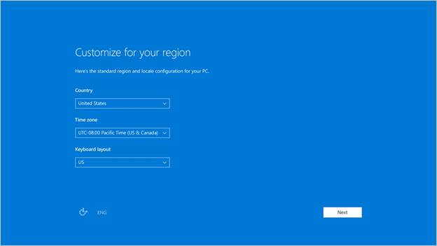
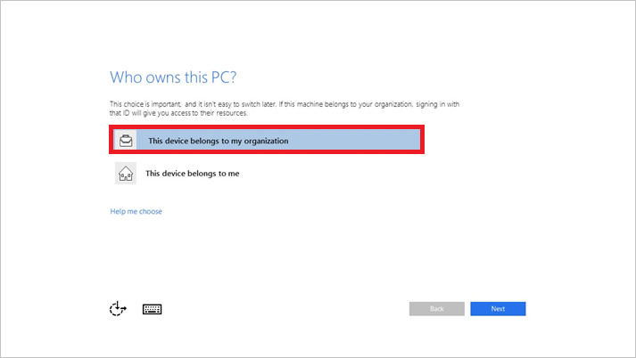
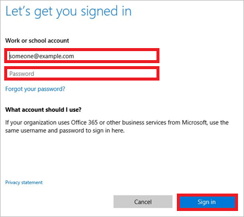
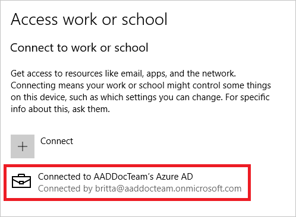

# Join a new Windows 10 device with Azure AD during a first run

With device management in Azure Active Directory (Azure AD), you can ensure that your users are accessing your resources from devices that meet your standards for security and compliance. For more information, see the [introduction to device management in Azure Active Directory](overview.md).

With Windows 10, You can join a new device to Azure AD during the first-run experience (FRX).  
This enables you to distribute shrink-wrapped devices to your employees or students.

If you have either Windows 10 Professional or Windows 10 Enterprise installed on a device, the experience defaults to the setup process for company-owned devices.

In the Windows *out-of-box experience*, joining an on-premises Active Directory (AD) domain is not supported. If you plan to join a computer to an AD domain, during setup, you should select the link **Set up Windows with a local account**. You can then join the domain from the settings on your computer.
 

## Before you begin

To join a Windows 10 device, the device registration service must be configured to enable you to register devices. In addition to having permission to joining devices in your Azure AD tenant, you must have fewer devices registered than the configured maximum. For more information, see [configure device settings](device-management-azure-portal.md#configure-device-settings).

In addition, if your tenant is federated, your Identity provider MUST support WS-Fed and WS-Trust username/password endpoint. This can be version 1.3 or 2005. This protocol support is required to both join the device to Azure AD and log on to the device with a password.

## Joining a device

**To join a Windows 10 device to Azure AD during FRX:**

1. When you turn on your new device and start the setup process, you should see the  **Getting Ready** message. Follow the prompts to set up your device.

2. Start by customizing your region and language. Then accept the Microsoft Software License Terms.
 
    

3. Select the network you want to use for connecting to the Internet.

4. Click **This device belongs to my organization**. 

    

5. Enter the credentials that were provided to you by your organization, and then click **Sign in**.

    

6. You device locates a matching tenant in Azure AD. If you are in a federated domain, you are redirected to your on-premises Secure Token Service (STS) server, for example, Active Directory Federation Services (AD FS).

7. If you are a user in a non-federated domain, enter your credentials directly on the Azure AD-hosted page. 

8. You are prompted for a multi-factor authentication challenge. 
 
9. Azure AD checks whether an enrollment in mobile device management is required.

10. Windows registers the device in the organization’s directory in Azure AD and enrolls it in mobile device management, if applicable.

11. If you are:
    - A managed user, Windows takes you to the desktop through the automatic sign-in process.

    - A federated user, you are directed to the Windows sign-in screen to enter your credentials.

## Verification

To verify whether a device is joined to your Azure AD, review the **Access work or school** dialog on your Windows device. The dialog should indicate that you are connected to your Azure AD directory.

## Next steps

- For more information, see the [introduction to device management in Azure Active Directory](overview.md).

- For more information about managing devices in the Azure AD portal, see [managing devices using the Azure portal](device-management-azure-portal.md).
