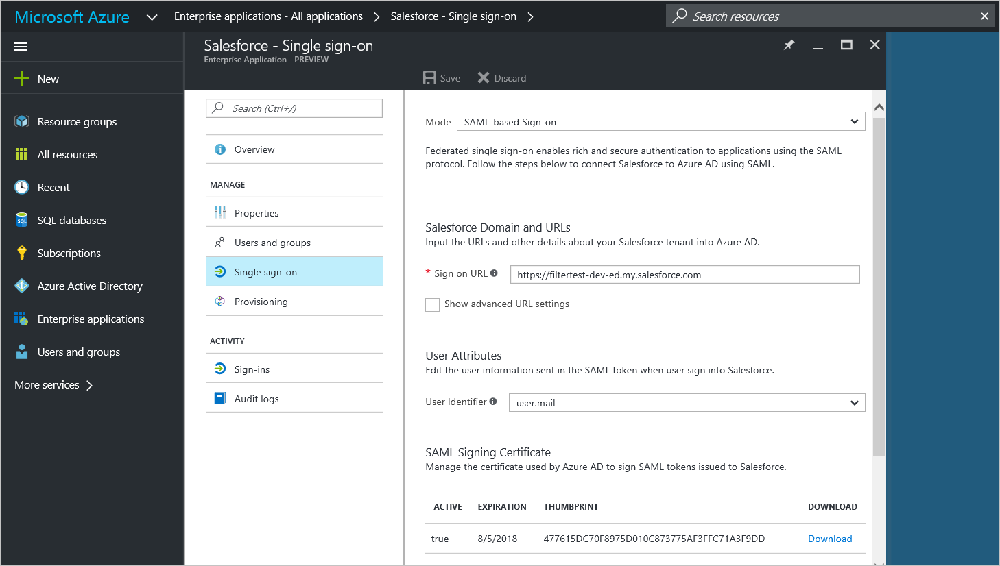
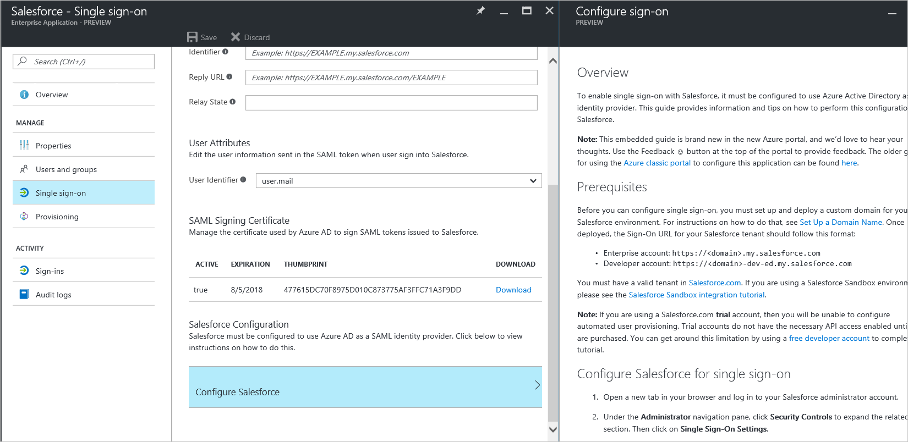
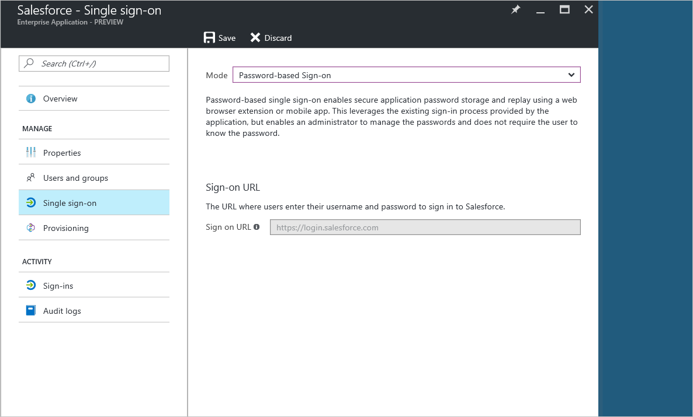
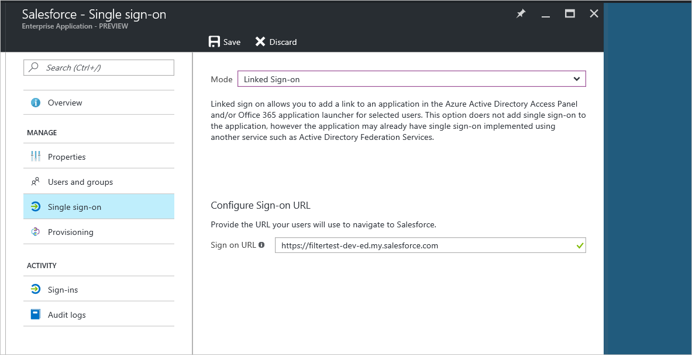

# Managing single sign-on for enterprise apps

This article describes how to use the [Azure portal](https://portal.azure.com) to manage single sign-on settings for enterprise applications. Enterprise apps are apps that are deployed and used within your organization. This article applies particularly to apps that were added from the [Azure Active Directory application gallery](what-is-single-sign-on.md#get-started-with-the-azure-ad-application-gallery). 

## Finding your apps in the portal
All enterprise apps that are set up for single sign-on can be viewed and managed in the Azure portal. The applications can be found in the **All Services** &gt; **Enterprise Applications** section of the portal. 

Select **All applications** to view a list of all apps that have been configured. Selecting an app displays the resources for that app, where reports can be viewed for that app and a variety of settings can be managed.

To manage single sign-on settings, select **Single sign-on**.

## Single sign-on modes
**Single sign-on** begins with a **Mode** menu, which allows the single sign-on mode to be configured. The available options include:

* **SAML-based sign-on** - This option is available if the application supports full federated single sign-on with Azure Active Directory using the SAML 2.0 protocol, WS-Federation, or OpenID connect protocols.
* **Password-based sign-on** - This option is available if Azure AD supports password form filling for this application.
* **Linked sign-on** - Formerly known as "Existing single sign-on", this option allows administrators to place a link to this application in their user's Azure AD Access Panel or Office 365 application launcher.

For more information about these modes, see [How does single sign-on with Azure Active Directory work](what-is-single-sign-on.md#how-does-single-sign-on-with-azure-active-directory-work).

## SAML-based sign-on
The **SAML-based sign-on** option is divided in four sections:

### Domains and URLs
This is where all details about the application's domain and URLs are added to your Azure AD directory. All inputs required to make single sign-on work app are displayed directly on the screen, whereas all optional inputs can be viewed by selecting the **Show advanced URL settings** checkbox. The full list of supported inputs includes:

* **sign-on URL** – Where the user goes to sign in to the application. If the application is configured to perform service-provider-initiated single sign-on, when a user opens this URL, the service provider redirects to Azure AD to authenticate and sign the user in. 
  * If this field is populated, then Azure AD uses the URL to start the application from Office 365 and the Azure AD Access Panel.
  * If this field is omitted, then Azure AD instead performs identity-provider-initiated sign-on when the app is launched from Office 365, the Azure AD Access Panel, or from the Azure AD single sign-on URL.
* **Identifier** - This URI should uniquely identify the application for which single sign-on is being configured. This is the value that Azure AD sends back to application as the Audience parameter of the SAML token, and the application is expected to validate it. This value also appears as the Entity ID in any SAML metadata provided by the application.
* **Reply URL** - The reply URL is where the application expects to receive the SAML token. This is also referred to as the Assertion Consumer Service (ACS) URL. After these have been entered, click Next to proceed to the next screen. This screen provides information about what needs to be configured on the application side to enable it to accept a SAML token from Azure AD.
* **Relay State** -  The relay state is an optional parameter that can help tell the application where to redirect the user after authentication is completed. Typically the value is a valid URL at the application, however some applications use this field differently (see the app's single sign-on documentation for details). The ability to set the relay state is a new feature that is unique to the new Azure portal.

### User Attributes
This is where admins can view and edit the attributes that are sent in the SAML token that Azure AD issues to the application each time users sign in.

The only editable attribute supported is the **User Identifier** attribute. The value of this attribute is the field in Azure AD that uniquely identifies each user within the application. For example, if the app was deployed using the "Email address" as the username and unique identifier, then the value would be set to the "user.mail" field in Azure AD.

### SAML Signing Certificate
This section shows the details of the certificate that Azure AD uses to sign the SAML tokens that are issued to the application each time the user authenticates. It allows the properties of the current certificate to be inspected, including the expiration date.

### Application Configuration
The final section provides the documentation and/or controls required to configure the application itself to use Azure Active Directory as an identity provider.

The **Configure Application** fly-out menu provides new concise, embedded instructions for configuring the application. This is another new feature unique to the new Azure portal.

> [!NOTE]
> For a complete example of embedded documentation, see the Salesforce.com application. Documentation for additional apps is being continually added.
> 
> 

## Password-based sign-on
If supported for the application, selecting the password-based SSO mode and selecting **Save** instantly configures it to do password-based SSO. For more information about deploying password-based SSO, see [How does single sign-on with Azure Active Directory work](what-is-single-sign-on.md#how-does-single-sign-on-with-azure-active-directory-work).

## Linked sign-on
If supported for the application, selecting the linked SSO mode allows you to enter the URL that you want the Azure AD Access Panel or Office 365 to redirect to when users click on this app. For more information about linked SSO (formerly known as "existing SSO"), see [How does single sign-on with Azure Active Directory work](what-is-single-sign-on.md#how-does-single-sign-on-with-azure-active-directory-work).

## Feedback

We hope you like using the improved Azure AD experience. Please keep the feedback coming! Post your feedback and ideas for improvement in the **Admin Portal** section of our [feedback forum](https://feedback.azure.com/forums/169401-azure-active-directory/category/162510-admin-portal).  We’re excited about building cool new stuff every day, and use your guidance to shape and define what we build next.

