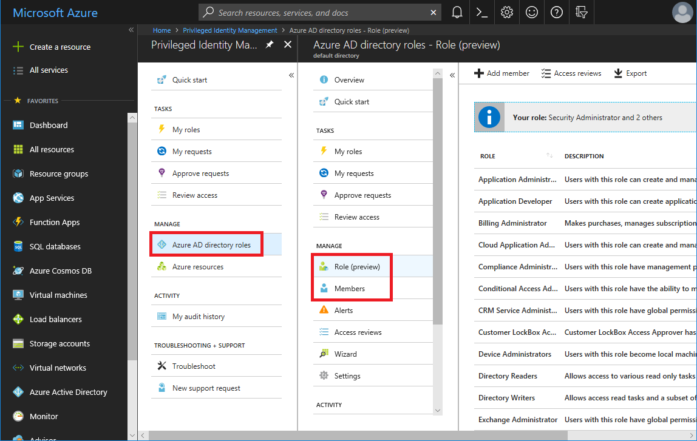
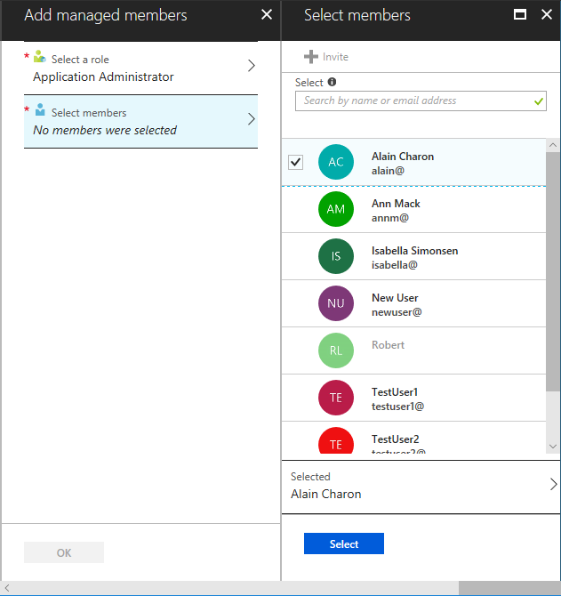
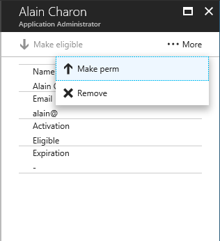
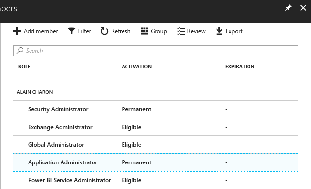
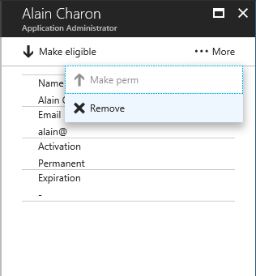

# Assign directory roles to users using Azure AD PIM

With Azure Active Directory (Azure AD), a Global Administrator can make **permanent** directory role assignments. These role assignments can be created using the [Azure portal](../users-groups-roles/directory-assign-admin-roles.md) or using [PowerShell commands](/powershell/module/azuread#directory_roles).

The Azure AD Privileged Identity Management (PIM) service also allows privileged role administrators to make permanent directory role assignments. Additionally, privileged role administrators can make users **eligible** for directory roles. An eligible administrator can activate the role when they need it, and then their permissions expire once they're done. For information about the roles that you can manage using PIM, see [Directory roles you can manage using Azure AD PIM](pim-roles.md).

## Make a user eligible for a role

Follow these steps to make a user eligible for an Azure AD directory role.

1. Sign in to [Azure portal](https://portal.azure.com/) with a user that is a member of the [Privileged Role Administrator](../users-groups-roles/directory-assign-admin-roles.md#privileged-role-administrator) role.

    For information about how to grant another user access to manage PIM, see [how to give access to PIM](pim-how-to-give-access-to-pim.md).

1. Open **Azure AD Privileged Identity Management**.

    If you haven't enabled PIM in the Azure portal yet, go to [Get started with Azure AD PIM](pim-getting-started.md).

1. Click **Azure AD directory roles**.

1. Click **Role (preview)** or **Members**.

    

1. Click **Add member** to open Add managed members.

1. Click **Select a role**, click a role you want to manage, and then click **Select**.

    

1. Click **Select members**, select the users you want to assign to the role, and then click **Select**.

    

1. In Add managed members, click **OK** to add the user to the role.

     When the role is assigned, the user you selected will appear in the members list as **eligible** for the role.

    

1. Now that the user is eligible for the role, let them know that they can activate it according to the instructions in [How to activate or deactivate a role](pim-how-to-activate-role.md).

    Eligible administrators are asked to register for Azure Multi-Factor Authentication (MFA) during activation. If a user cannot register for MFA, or is using a Microsoft account (usually @outlook.com), you need to make them permanent in all their roles.

## Make a role assignment permanent

By default, new users are only eligible for a directory role. Follow these steps if you want to make a role assignment permanent.

1. Open **Azure AD Privileged Identity Management**.

1. Click **Azure AD directory roles**.

1. Click **Members**.

    

1. Click an **eligible** role that you want to make permanent.

1. Click **More** and then click **Make perm**.

    

    The role is now listed as **permanent**.

    

## Remove a user from a role

You can remove users from role assignments, but make sure there is always at least one user who is a permanent Global Administrator. If you're not sure which users still need their role assignments, you can [start an access review for the role](pim-how-to-start-security-review.md).

Follow these steps to remove a specific user from a directory role.

1. Open **Azure AD Privileged Identity Management**.

1. Click **Azure AD directory roles**.

1. Click **Members**.

    

1. Click a role assignment you want to remove.

1. Click **More** and then click **Remove**.

    

1. In the message that asks you to confirm, click **Yes**.

    

    The role assignment is removed.

## Next steps
[!INCLUDE [active-directory-privileged-identity-management-toc](../../../includes/active-directory-privileged-identity-management-toc.md)]
