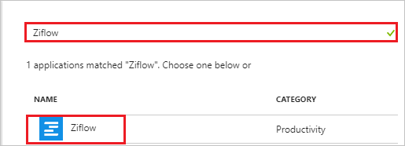
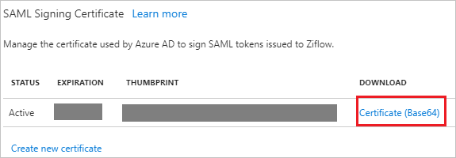
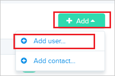
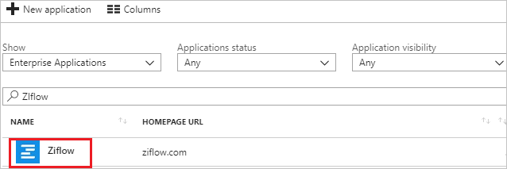

---
title: 'Tutorial: Azure Active Directory integration with Ziflow | Microsoft Docs'
description: Learn how to configure single sign-on between Azure Active Directory and Ziflow.
services: active-directory
documentationCenter: na
author: jeevansd
manager: femila
ms.reviewer: joflore

ms.assetid: 84e60fa4-36fb-49c4-a642-95538c78f926
ms.service: active-directory
ms.component: saas-app-tutorial
ms.workload: identity
ms.tgt_pltfrm: na
ms.devlang: na
ms.topic: article
ms.date: 04/09/2018
ms.author: jeedes

---
# Tutorial: Azure Active Directory integration with Ziflow

In this tutorial, you learn how to integrate Ziflow with Azure Active Directory (Azure AD).

Integrating Ziflow with Azure AD provides you with the following benefits:

- You can control in Azure AD who has access to Ziflow.
- You can enable your users to automatically get signed-on to Ziflow (Single Sign-On) with their Azure AD accounts.
- You can manage your accounts in one central location - the Azure portal.

If you want to know more details about SaaS app integration with Azure AD, see [what is application access and single sign-on with Azure Active Directory](../manage-apps/what-is-single-sign-on.md).

## Prerequisites

To configure Azure AD integration with Ziflow, you need the following items:

- An Azure AD subscription
- A Ziflow single sign-on enabled subscription

> [!NOTE]
> To test the steps in this tutorial, we do not recommend using a production environment.

To test the steps in this tutorial, you should follow these recommendations:

- Do not use your production environment, unless it is necessary.
- If you don't have an Azure AD trial environment, you can [get a one-month trial](https://azure.microsoft.com/pricing/free-trial/).

## Scenario description
In this tutorial, you test Azure AD single sign-on in a test environment. 
The scenario outlined in this tutorial consists of two main building blocks:

1. Adding Ziflow from the gallery
1. Configuring and testing Azure AD single sign-on

## Adding Ziflow from the gallery
To configure the integration of Ziflow into Azure AD, you need to add Ziflow from the gallery to your list of managed SaaS apps.

**To add Ziflow from the gallery, perform the following steps:**

1. In the **[Azure portal](https://portal.azure.com)**, on the left navigation panel, click **Azure Active Directory** icon. 

	![The Azure Active Directory button][1]

1. Navigate to **Enterprise applications**. Then go to **All applications**.

	![The Enterprise applications blade][2]
	
1. To add new application, click **New application** button on the top of dialog.

	![The New application button][3]

1. In the search box, type **Ziflow**, select **Ziflow** from result panel then click **Add** button to add the application.

	

## Configure and test Azure AD single sign-on

In this section, you configure and test Azure AD single sign-on with Ziflow based on a test user called "Britta Simon".

For single sign-on to work, Azure AD needs to know what the counterpart user in Ziflow is to a user in Azure AD. In other words, a link relationship between an Azure AD user and the related user in Ziflow needs to be established.

To configure and test Azure AD single sign-on with Ziflow, you need to complete the following building blocks:

1. **[Configure Azure AD Single Sign-On](#configure-azure-ad-single-sign-on)** - to enable your users to use this feature.
1. **[Create an Azure AD test user](#create-an-azure-ad-test-user)** - to test Azure AD single sign-on with Britta Simon.
1. **[Create a Ziflow test user](#create-a-ziflow-test-user)** - to have a counterpart of Britta Simon in Ziflow that is linked to the Azure AD representation of user.
1. **[Assign the Azure AD test user](#assign-the-azure-ad-test-user)** - to enable Britta Simon to use Azure AD single sign-on.
1. **[Test single sign-on](#test-single-sign-on)** - to verify whether the configuration works.

### Configure Azure AD single sign-on

In this section, you enable Azure AD single sign-on in the Azure portal and configure single sign-on in your Ziflow application.

**To configure Azure AD single sign-on with Ziflow, perform the following steps:**

1. In the Azure portal, on the **Ziflow** application integration page, click **Single sign-on**.

	![Configure single sign-on link][4]

1. On the **Single sign-on** dialog, select **Mode** as	**SAML-based Sign-on** to enable single sign-on.
 
	

1. On the **Ziflow Domain and URLs** section, perform the following steps:

	

    a. In the **Sign on URL** textbox, type a URL using the following pattern: `https://<subdomain>.ziflow.io/#/login-sso/<Unique ID>`

    b. In the **Identifier** textbox, type a URL using the following pattern: `urn:auth0:ziflow-production:<Unique ID>`

	> [!NOTE] 
	> The preceding values are not real. You will update the unique ID value in the Identifier and Sign on URL with  actual value, which is explained later in the tutorial. Contact [Ziflow support team](mailto:support@ziflow.com) for the subdomain value in the Sign-on URL.
	
1. On the **SAML Signing Certificate** section, click **Certificate (Base64)** and then save the certificate file on your computer.

	 

1. Click **Save** button.

	

1. On the **Ziflow Configuration** section, click **Configure Ziflow** to open **Configure sign-on** window. Copy the **Sign-Out URL and SAML Single Sign-On Service URL** from the **Quick Reference section.**

	 

1. In a different web browser window, login to Ziflow as a Security Administrator.

1. Click on Avatar in the top right corner, and then click **Manage account**.

	

1. In the top left, click **Single Sign-On**.

	

1. On the **Single Sign-On** page, perform the following steps:

	

	a. Select **Type** as **SAML2.0**.

	b.In the **Sign In URL** textbox, paste the value of **SAML Single Sign-On Service URL**, which you have copied from the Azure portal.

    c. Upload the base-64 encoded certificate that you have downloaded from the Azure portal, into the **X509 Signing Certificate**.

	d. In the **Sign Out URL** textbox, paste the value of **Sign-Out URL**, which you have copied from the Azure portal.

	e. From the **Configuration Settings for your Identifier Provider** section, copy the highlighted unique ID value and append it with the Identifier and Sign on URL in the **Ziflow Domain and URLs section** on Azure portal.

### Create an Azure AD test user

The objective of this section is to create a test user in the Azure portal called Britta Simon.

   ![Create an Azure AD test user][100]

**To create a test user in Azure AD, perform the following steps:**

1. In the Azure portal, in the left pane, click the **Azure Active Directory** button.

    

1. To display the list of users, go to **Users and groups**, and then click **All users**.

    

1. To open the **User** dialog box, click **Add** at the top of the **All Users** dialog box.

    

1. In the **User** dialog box, perform the following steps:

    

    a. In the **Name** box, type **BrittaSimon**.

    b. In the **User name** box, type the email address of user Britta Simon.

    c. Select the **Show Password** check box, and then write down the value that's displayed in the **Password** box.

    d. Click **Create**.
  
### Create a Ziflow test user

To enable Azure AD users to log in to Ziflow, they must be provisioned into Ziflow. In Ziflow, provisioning is a manual task.

To provision a user account, perform the following steps:

1. Log in to Ziflow as a Security Administrator.

1. Navigate to **People** on the top.

	

1. Click **Add** and then click **Add user**.

	

1. On the **Add a user** popup, perform the following steps:

	

	a. In **Email** text box, enter the email of user like brittasimon@contoso.com.

	b. In **First name** text box, enter the first name of user like Britta.

	c. In **Last name** text box, enter the last name of user like Simon.

	d. Select your Ziflow role.

	e. Click **Add 1 user**.

	> [!NOTE]
    > The Azure Active Directory account holder receives an email and follows a link to confirm their account before it becomes active.

### Assign the Azure AD test user

In this section, you enable Britta Simon to use Azure single sign-on by granting access to Ziflow.

![Assign the user role][200] 

**To assign Britta Simon to Ziflow, perform the following steps:**

1. In the Azure portal, open the applications view, and then navigate to the directory view and go to **Enterprise applications** then click **All applications**.

	![Assign User][201] 

1. In the applications list, select **Ziflow**.

	  

1. In the menu on the left, click **Users and groups**.

	![The "Users and groups" link][202]

1. Click **Add** button. Then select **Users and groups** on **Add Assignment** dialog.

	![The Add Assignment pane][203]

1. On **Users and groups** dialog, select **Britta Simon** in the Users list.

1. Click **Select** button on **Users and groups** dialog.

1. Click **Assign** button on **Add Assignment** dialog.
	
### Test single sign-on

In this section, you test your Azure AD single sign-on configuration using the Access Panel.

When you click the Ziflow tile in the Access Panel, you should get automatically signed-on to your Ziflow application.
For more information about the Access Panel, see [Introduction to the Access Panel](../user-help/active-directory-saas-access-panel-introduction.md). 

## Additional resources

* [List of Tutorials on How to Integrate SaaS Apps with Azure Active Directory](tutorial-list.md)
* [What is application access and single sign-on with Azure Active Directory?](../manage-apps/what-is-single-sign-on.md)

<!--Image references-->

[1]: ./media/ziflow-tutorial/tutorial_general_01.png
[2]: ./media/ziflow-tutorial/tutorial_general_02.png
[3]: ./media/ziflow-tutorial/tutorial_general_03.png
[4]: ./media/ziflow-tutorial/tutorial_general_04.png

[100]: ./media/ziflow-tutorial/tutorial_general_100.png

[200]: ./media/ziflow-tutorial/tutorial_general_200.png
[201]: ./media/ziflow-tutorial/tutorial_general_201.png
[202]: ./media/ziflow-tutorial/tutorial_general_202.png
[203]: ./media/ziflow-tutorial/tutorial_general_203.png

