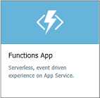
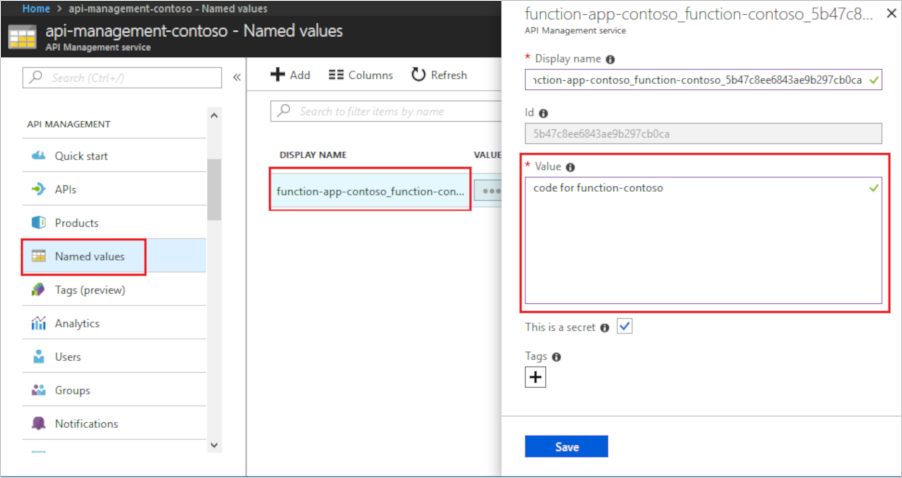
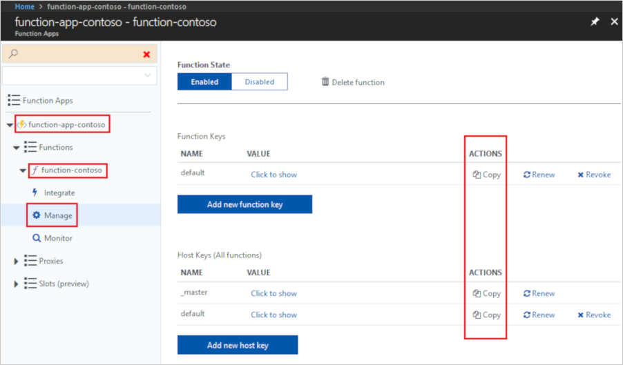
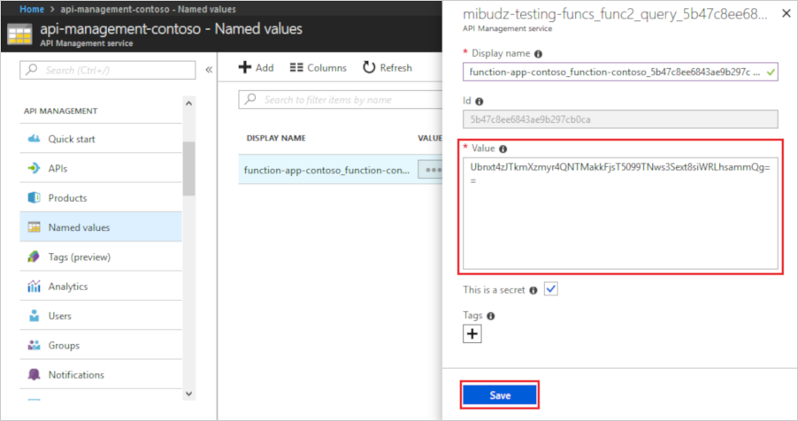

# Import an Azure Functions app as an API

This article shows how to import an Azure Functions app as an API. The article also shows how to test the Azure API Management API.

In this article, you learn how to:

> [!div class="checklist"]
> * Import a Functions app as an API
> * Test the API in the Azure portal
> * Test the API in the developer portal

## Prerequisites

+ Complete the quickstart [Create an Azure API Management instance](get-started-create-service-instance.md).
+ Make sure you have an Azure Functions app in your subscription. For more information, see [Create a Functions app](../azure-functions/functions-create-first-azure-function.md#create-a-function-app).
+ [Create an OpenAPI definition](../azure-functions/functions-openapi-definition.md) of your Azure Functions app.

[!INCLUDE [api-management-navigate-to-instance.md](../../includes/api-management-navigate-to-instance.md)]

## Import and publish a back-end API

1. Under **API MANAGEMENT**, select **APIs**.
2. In the **Add a new API** list, select **Functions App**.

    
3. Select **Browse** to see the list of Functions apps in your subscription.
4. Select the app. API Management finds the swagger that's associated with the selected app, fetches it, and then imports it. 
5. Add an API URL suffix. The suffix is a name that identifies this specific API in this API Management instance. The suffix must be unique in this API Management instance.
6. Publish the API by associating the API with a product. In this case, the **Unlimited** product is used. If you want the API to be published and available to developers, add the API to a product. You can add the API to a product when you create the API, or you can add it later.

    Products are associations of one or more APIs. You can include multiple APIs and offer them to developers through the developer portal. Developers must first subscribe to a product to get access to the API. When a developer subscribes, the developer gets a subscription key that is good for any API in that product. If you created the API Management instance, you are an administrator. Administrators are subscribed to every product by default.

    By default, each API Management instance comes with two sample products:

    * **Starter**
    * **Unlimited**   
7. Select **Create**.

## Populate Azure Functions keys in Azure API Management

If the imported Azure Functions apps are protected by keys, API Management automatically creates *named values* for the keys. API Management doesn't populate the entries with secrets. Complete the following steps for each entry:  

1. In the API Management instance, select the **Named values** tab.
2. Select an entry, and then select **Show value** in the sidebar.

    

3. If the text displayed in the **Value** box is similar to **code for \<Azure Functions name\>**, go to **Functions Apps**, and then go to **Functions**.
4. Select **Manage**, and then copy the relevant key based on your app's authentication method.

    

5. Paste the key in the **Value** box, and then select **Save**.

    

## Test the new API Management API in the Azure portal

You can call operations directly from the Azure portal. Using the Azure portal is a convenient way to view and test the operations of an API.  

1. Select the API that you created in the preceding section.
2. Select the **Test** tab.
3. Select an operation.

    The page displays fields for query parameters and fields for the headers. One of the headers is **Ocp-Apim-Subscription-Key**, for the subscription key of the product that is associated with this API. If you created the API Management instance, you are an administrator already, so the key is filled in automatically. 
4. Select **Send**.

    The back end responds with **200 OK** and some data.

## Call an operation from the developer portal

You can also call operations from the developer portal to test APIs. 

1. Select the API that you created in [Import and publish a back-end API](#create-api).
2. Select **Developer portal**.

    The developer portal site opens.
3. Select the **API** that you created.
4. Select the operation you want to test.
5. Select **Try it**.
6. Select **Send**.
    
    After an operation is invoked, the developer portal displays the **Response status**, the **Response headers**, and any **Response content**.

[!INCLUDE [api-management-navigate-to-instance.md](../../includes/api-management-append-apis.md)]

[!INCLUDE [api-management-define-api-topics.md](../../includes/api-management-define-api-topics.md)]

## Next steps

> [!div class="nextstepaction"]
> [Transform and protect a published API](transform-api.md)