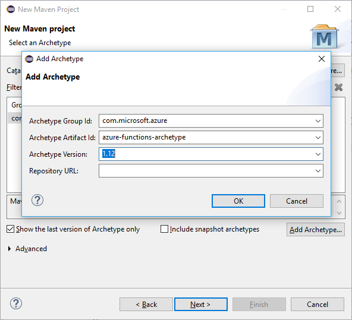

# Create your first function with Java and Eclipse (Preview)

> [!NOTE] 
> Java for Azure Functions is currently in preview.

This article shows you how to create a [serverless](https://azure.microsoft.com/overview/serverless-computing/) function project with the Eclipse IDE and Apache Maven, test and debug it, then deploy it to Azure Functions. 

<!-- TODO  -->

[!INCLUDE [quickstarts-free-trial-note](../../includes/quickstarts-free-trial-note.md)]

## Set up your development environment

To develop a functions app with Java and Eclipse, you must have the following installed:

-  [Java Developer Kit](https://www.azul.com/downloads/zulu/), version 8.
-  [Apache Maven](https://maven.apache.org), version 3.0 or above.
-  [Eclipse](https://www.eclipse.org/downloads/packages/), with Java and Maven support.
-  [Azure CLI](https://docs.microsoft.com/cli/azure)

> [!IMPORTANT] 
> The JAVA_HOME environment variable must be set to the install location of the JDK to complete this quickstart.

It's highly recommended to also install [Azure Functions Core Tools, version 2](functions-run-local.md#v2), which provide a local environment for running and debugging Azure Functions. 

## Create a Functions project

1. In Eclipse, select the **File** menu, then select **Project**. 
1. Open the **Java Project** folder in the **New Project** window and select **Maven Project**, then select **Next**.
1. Accept the defaults in the **New Maven Project** dialogue and select **Next**.
1. Select **Add Archetype** and add the entries for the [azure-functions-archetype](https://mvnrepository.com/artifact/com.microsoft.azure/azure-functions-archetype).
    - Archetype Group ID: com.microsoft.azure
    - Archetype Artifact ID: azure-functions-archetype
    - Version: Use latest version from [the central repository](https://mvnrepository.com/artifact/com.microsoft.azure/azure-functions-archetype)
      
1. Click **OK** and enter details for current project, and eventually **Finish**.

Maven creates the project files in a new folder with a name of _artifactId_. The generated code in the project is a simple [HTTP triggered](/azure/azure-functions/functions-bindings-http-webhook) function that echoes the body of the triggering HTTP request.

## Run functions locally in the IDE

> [!NOTE]
> [Azure Functions Core Tools, version 2](functions-run-local.md#v2) must be installed to run and debug functions locally.

1. Right-click on the generated project, then choose **Run As** and **Maven build**.
1. In the **Edit Configuration** dialog, Enter `package` in the **Goals** and **Name** fields, then select **Run**. This will build and package the function code.
1. Once the build is complete, create another Run configuration as above, using `azure-functions:run` as the goal and name. Select **Run** to run the function in the IDE.

Terminate the runtime in the console window when you're done testing your function. Only one function host can be active and running locally at a time.

### Debug the function in Eclipse

In your Run As configuration set up in the previous step, change `azure-functions:run` to `mvn azure-functions:run -DenableDebug` and run the updated configuration to start the function app in debug mode.

Select the **Run** menu and open **Debug Configurations**. Choose **Remote Java Application** and create a new one. Give your configuration a name and fill in the settings. The port should be consistent with the debug port opened by function host, which by default is `5005`. After setup, click on `Debug` to start debugging.


Set breakpoints and inspect objects in your function using the IDE. When finished, stop the debugger and the running function host. Only one function host can be active and running locally at at time.

## Deploy the function to Azure

The deploy process to Azure Functions uses account credentials from the Azure CLI. [Log in with the Azure CLI](/cli/azure/authenticate-azure-cli?view=azure-cli-latest) before continuing using your computer's command prompt.

```azurecli
az login
```

Deploy your code into a new Function app using the `azure-functions:deploy` Maven goal in a new **Run As** configuration.

When the deploy is complete, you see the URL you can use to access your Azure function app:

```output
[INFO] Successfully deployed Function App with package.
[INFO] Deleting deployment package from Azure Storage...
[INFO] Successfully deleted deployment package fabrikam-function-20170920120101928.20170920143621915.zip
[INFO] Successfully deployed Function App at https://fabrikam-function-20170920120101928.azurewebsites.net
[INFO] ------------------------------------------------------------------------
```

## Next steps

- Review the  [Java Functions developer guide](functions-reference-java.md) for more information on developing Java functions.
- Add additional functions with different triggers to your project using the `azure-functions:add` Maven target.
