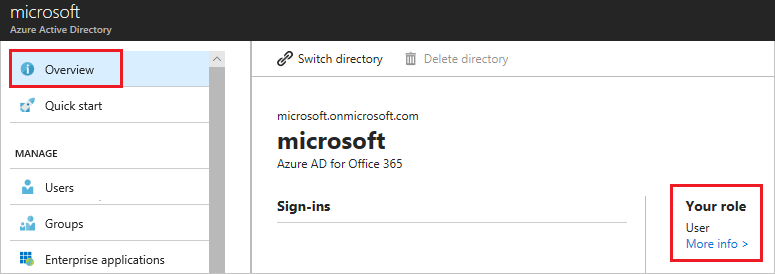
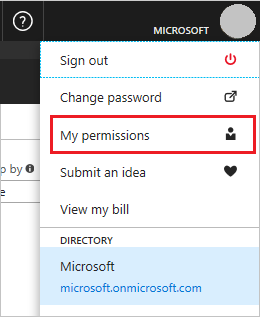
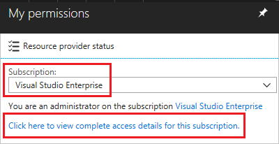
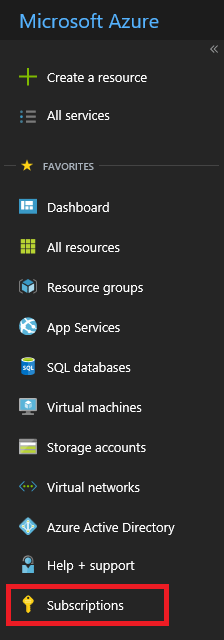
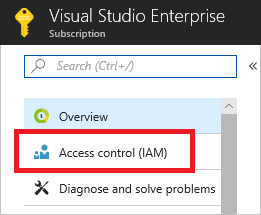

# Use portal to create an Azure Active Directory application and service principal that can access resources

When you have code that needs to access or modify resources, you must set up an Azure Active Directory (AD) application. You can then assign the required permissions to the AD application. This approach is preferable to running the app under your own credentials because you can assign permissions to the app identity that are different than your own permissions. Typically, these permissions are restricted to exactly what the app needs to do.

This article shows you how to perform these steps through the portal. It focuses on a single-tenant application where the application is intended to run within only one organization. You typically use single-tenant applications for line-of-business applications that run within your organization.

> [!IMPORTANT]
> Instead of creating a service principal, consider using Azure AD Managed Service Identity for your application identity. Azure AD MSI is a public preview feature of Azure Active Directory that simplifies creating an identity for code. If your code runs on a service that supports Azure AD MSI and accesses resources that support Azure Active Directory authentication, Azure AD MSI is a better option for you. To learn more about Azure AD MSI, including which services currently support it, see [Managed Service Identity for Azure resources](../active-directory/managed-service-identity/overview.md).

## Required permissions

To complete this article, you must have sufficient permissions to register an application with your Azure AD tenant, and assign the application to a role in your Azure subscription. Let's make sure you have the right permissions to perform those steps.

### Check Azure Active Directory permissions

1. Select **Azure Active Directory**.

   

1. In Azure Active Directory, select **User settings**.

   

1. Check the **App registrations** setting. If set to **Yes**, non-admin users can register AD apps. This setting means any user in the Azure AD tenant can register an app. You can proceed to [Check Azure subscription permissions](#check-azure-subscription-permissions).

   

1. If the app registrations setting is set to **No**, only [global administrators](../active-directory/users-groups-roles/directory-assign-admin-roles.md) can register apps. Check whether your account is an admin for the Azure AD tenant. Select **Overview** and look at your user information. If your account is assigned to the User role, but the app registration setting (from the preceding step) is limited to admin users, ask your administrator to either assign you to the global administrator role, or to enable users to register apps.

   

### Check Azure subscription permissions

In your Azure subscription, your account must have `Microsoft.Authorization/*/Write` access to assign an AD app to a role. This action is granted through the [Owner](../role-based-access-control/built-in-roles.md#owner) role or [User Access Administrator](../role-based-access-control/built-in-roles.md#user-access-administrator) role. If your account is assigned to the **Contributor** role, you do not have adequate permission. You receive an error when attempting to assign the service principal to a role.

To check your subscription permissions:

1. Select your account in the upper right corner, and select **My permissions**.

   

1. From the drop-down list, select the subscription. Select **Click here to view complete access details for this subscription**.

   

1. View your assigned roles, and determine if you have adequate permissions to assign an AD app to a role. If not, ask your subscription administrator to add you to User Access Administrator role. In the following image, the user is assigned to the Owner role, which means that user has adequate permissions.

   

## Create an Azure Active Directory application

1. Log in to your Azure Account through the [Azure portal](https://portal.azure.com).
1. Select **Azure Active Directory**.

   

1. Select **App registrations**.

   

1. Select **New application registration**.

   

1. Provide a name and URL for the application. Select **Web app / API** for the type of application you want to create. You cannot create credentials for a [Native application](../active-directory/manage-apps/application-proxy-configure-native-client-application.md); therefore, that type does not work for an automated application. After setting the values, select **Create**.

   

You have created your application.

## Get application ID and authentication key

When programmatically logging in, you need the ID for your application and an authentication key. To get those values, use the following steps:

1. From **App registrations** in Azure Active Directory, select your application.

   

1. Copy the **Application ID** and store it in your application code. Some [sample applications](#log-in-as-the-application) refer to this value as the client ID.

   

1. To generate an authentication key, select **Settings**.

   

1. To generate an authentication key, select **Keys**.

   

1. Provide a description of the key, and a duration for the key. When done, select **Save**.

   

   After saving the key, the value of the key is displayed. Copy this value because you are not able to retrieve the key later. You provide the key value with the application ID to log in as the application. Store the key value where your application can retrieve it.

   

## Get tenant ID

When programmatically logging in, you need to pass the tenant ID with your authentication request.

1. Select **Azure Active Directory**.

   

1. To get the tenant ID, select **Properties** for your Azure AD tenant.

   

1. Copy the **Directory ID**. This value is your tenant ID.

   

## Assign application to role

To access resources in your subscription, you must assign the application to a role. Decide which role represents the right permissions for the application. To learn about the available roles, see [RBAC: Built in Roles](../role-based-access-control/built-in-roles.md).

You can set the scope at the level of the subscription, resource group, or resource. Permissions are inherited to lower levels of scope. For example, adding an application to the Reader role for a resource group means it can read the resource group and any resources it contains.

1. Navigate to the level of scope you wish to assign the application to. For example, to assign a role at the subscription scope, select **Subscriptions**. You could instead select a resource group or resource.

   

1. Select the particular subscription (resource group or resource) to assign the application to.

   

1. Select **Access Control (IAM)**.

   

1. Select **Add**.

   

1. Select the role you wish to assign to the application. In order to allow the application execute actions like **reboot**, **start** and **stop** instances, you must have to select the role **Contributor**. The following image shows the **Reader** role.

   

1. By default, Azure Active Directory applications aren't displayed in the available options. To find your application, you must provide the name of it in the search field. Select it.

   

1. Select **Save** to finish assigning the role. You see your application in the list of users assigned to a role for that scope.

## Next steps
* To set up a multi-tenant application, see [Developer's guide to authorization with the Azure Resource Manager API](resource-manager-api-authentication.md).
* To learn about specifying security policies, see [Azure Role-based Access Control](../role-based-access-control/role-assignments-portal.md).  
* For a list of available actions that can be granted or denied to users, see [Azure Resource Manager Resource Provider operations](../role-based-access-control/resource-provider-operations.md).
