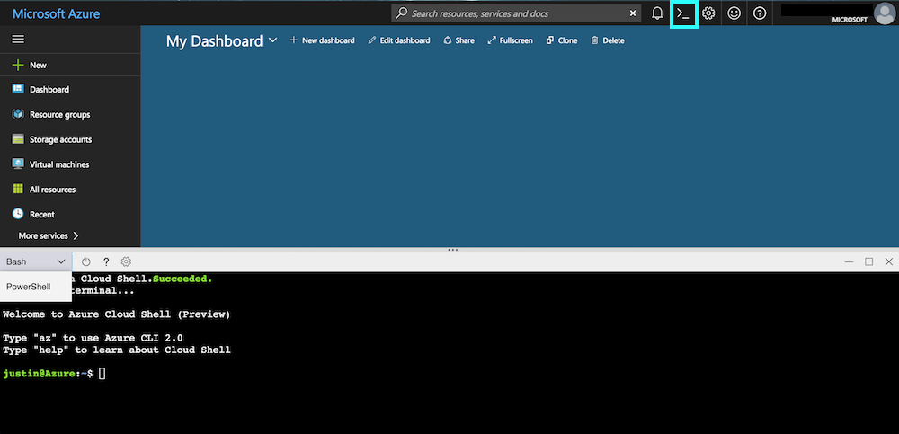
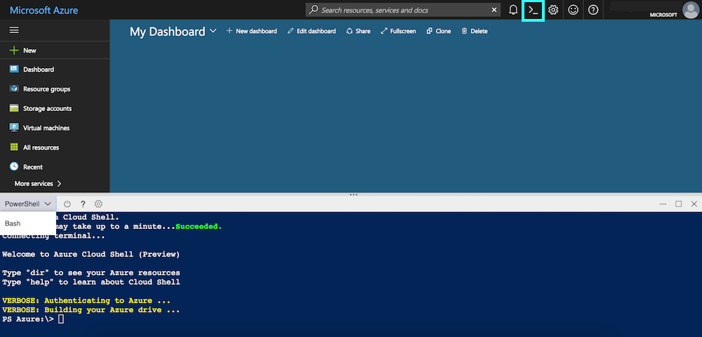

# Overview of Azure Cloud Shell
Azure Cloud Shell is an interactive, browser-accessible shell for managing Azure resources.
It provides the flexibility of choosing the shell experience that best suits the way you work.
Linux users can opt for a Bash experience, while Windows users can opt for PowerShell.

Try from shell.azure.com by clicking below.

Try from Azure portal using the Cloud Shell icon.

## Features
### Browser-based shell experience
Cloud Shell enables access to a browser-based command-line experience built with Azure management tasks in mind.
Leverage Cloud Shell to work untethered from a local machine in a way only the cloud can provide.

### Choice of preferred shell experience
Linux users can use Bash in Cloud Shell, while Windows users can use PowerShell in Cloud Shell (Preview) from the shell dropdown.

### Authenticated and configured Azure workstation
Cloud Shell is managed by Microsoft so it comes with popular command-line tools and language support. Cloud Shell also securely authenticates automatically for instant access to your resources through the Azure CLI 2.0 or Azure PowerShell cmdlets.

View the full [list of tools installed in Cloud Shell.](features.md#tools)

### Integrated Cloud Shell editor
Cloud Shell offers an integrated graphical text editor based on the open-source Monaco Editor. Simply create and edit configuration files by running `code .` for seamless deployment through Azure CLI 2.0 or Azure PowerShell.

[Learn more about the Cloud Shell editor](using-cloud-shell-editor.md).

### Multiple access points
Cloud Shell is a flexible tool that can be used from:
* [portal.azure.com](https://portal.azure.com)
* [shell.azure.com](https://shell.azure.com)
* [Azure CLI 2.0 "Try It" documentation](https://docs.microsoft.com/cli/azure?view=azure-cli-latest)
* [Azure mobile app](https://azure.microsoft.com/features/azure-portal/mobile-app/)
* [VS Code Azure Account extension](https://marketplace.visualstudio.com/items?itemName=ms-vscode.azure-account)

### Connect your Microsoft Azure Files storage
Cloud Shell machines are temporary and require an Azure Files share to be mounted as `clouddrive` to persist your files.

On first launch Cloud Shell prompts to create a resource group, storage account, and Azure Files share on your behalf. This is a one-time step and will be automatically attached for all sessions. A single file share can be mapped and will be used by both Bash and PowerShell in Cloud Shell (Preview).

#### Create new storage

A locally-redundant storage (LRS) account and Azure Files share can be created on your behalf. The Azure Files share will be used for both Bash and PowerShell environments if you choose to use both. Regular storage costs apply.

Three resources will be created on your behalf:
1. Resource Group named: `cloud-shell-storage-<region>`
2. Storage Account named: `cs<uniqueGuid>`
3. File Share named: `cs-<user>-<domain>-com-<uniqueGuid>`

> [!Note]
> Bash in Cloud Shell also creates a default 5-GB disk image to persist `$Home`. All files in your $Home directory such as SSH keys are persisted in your user disk image stored in your mounted Azure file share. Apply best practices when saving files in your $Home directory and mounted Azure file share.

#### Use existing resources

An advanced option is provided to associate existing resources to Cloud Shell.
At the storage setup prompt, click "Show advanced settings" to show additional options.

> [!Note]
> Dropdowns are filtered for your pre-assigned Cloud Shell region and LRS/GRS/ZRS storage accounts.

[Learn about Cloud Shell storage, updating Azure file shares, and uploading/downloading files.](persisting-shell-storage.md)

## Concepts
* Cloud Shell runs on a temporary host provided on a per-session, per-user basis
* Cloud Shell times out after 20 minutes without interactive activity
* Cloud Shell requires an Azure file share to be mounted
* Cloud Shell uses the same Azure file share for both Bash and PowerShell
* Cloud Shell is assigned one machine per user account
* Cloud Shell persists $Home using a 5-GB image held in your file share
* Permissions are set as a regular Linux user in Bash

Learn more about features in [Bash in Cloud Shell](features.md) and [PowerShell in Cloud Shell (Preview)](features-powershell.md).

## Pricing
The machine hosting Cloud Shell is free, with a pre-requisite of a mounted Azure Files share. Regular storage costs apply.

## Next steps
[Bash in Cloud Shell quickstart](quickstart.md)  
[PowerShell in Cloud Shell (Preview) quickstart](quickstart-powershell.md)