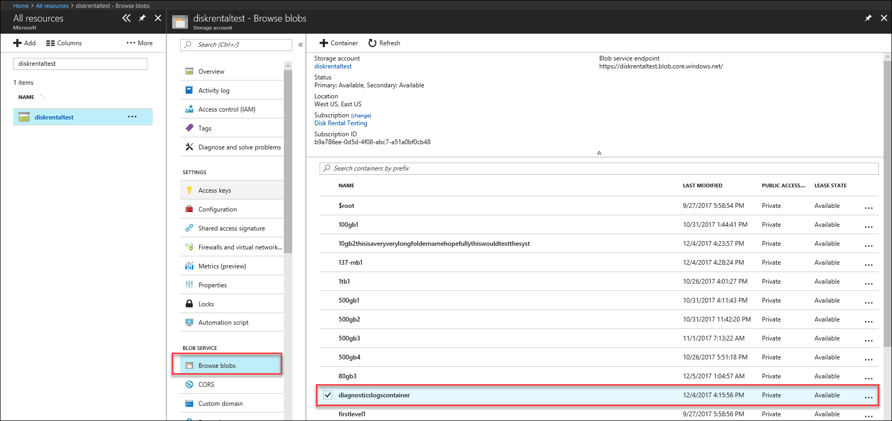
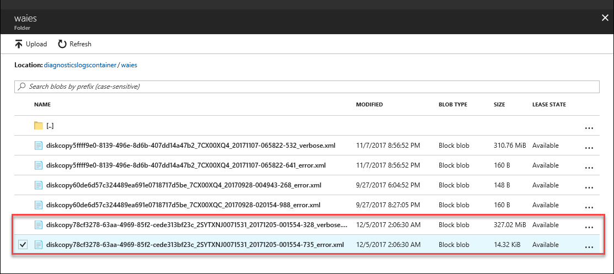

# Troubleshoot issues in Azure Data Box Disk (Preview)

This article applies to Microsoft Azure Data Box running Preview release. This article describes some of the complex workflows and management tasks that can be performed on the Data Box and Data Box Disk. 

You can manage the Data Box Disk via the Azure portal. This article focuses on the tasks that you can perform using the Azure portal. Use the Azure portal to manage orders, manage devices, and track the status of the order as it proceeds to completion.

This article includes the following tutorials:

- Download diagnostic logs
- Query activity logs

> [!IMPORTANT]
> Data Box is in preview. Review the [Azure terms of service for preview](https://azure.microsoft.com/support/legal/preview-supplemental-terms/) before you deploy this solution.

## Download diagnostic logs

If there are any errors during the data copy process, then the portal displays a path to the folder where the diagnostics logs are located. 

The diagnostics logs can be:
- Error logs
- Verbose logs  

To navigate to the path for copy log, go to the storage account associated with your Data Box order. 

1.	Go to **General > Order details** and make a note of the storage account associated with your order.
 

2.	Go to **All resources** and search for the storage account identified in the previous step. Select and click the storage account.

    

3.	Go to **Blob service > Browse blobs** and look for the blob corresponding to the storage account. Go to **diagnosticslogcontainer > waies**. 

    

    You should see both the error logs and the verbose logs for data copy. Select and click each file and then download a local copy.

## Query Activity logs

Use the activity logs to find an error when troubleshooting or to monitor how a user in your organization modified a resource. Through activity logs, you can determine:

- What operations were taken on the resources in your subscription.
- Who initiated the operation. 
- When the operation occurred.
- The status of the operation.
- The values of other properties that might help you research the operation.

The activity log contains all write operations (such as PUT, POST, DELETE) performed on your resources but not the read operations (such as GET). 

Activity logs are retained for 90 days. You can query for any range of dates, as long as the starting date is not more than 90 days in the past. You can also filter by one of the built-in queries in Insights. For instance, click error and then select and click specific failures to understand the root cause.

## Data Box Disk unlock tool errors

| Error message/Tool behavior      | Recommendations                                                                                               |
|-------------------------------------------------------------------------------------------------------------------------------------|------------------------------------------------------------------------------------------------------|
| None  Data Box Disk unlock tool crashes.                                                                            | Bitlocker not installed. Ensure that the host computer that is running the Data Box Disk unlock tool has BitLocker installed.                                                                            |
| The current .NET Framework is not supported. The supported versions are 4.5 and later.  Tool exits with a message.  | .NET 4.5 is not installed. Install .NET 4.5 or later on the host computer that runs the Data Box Disk unlock tool.                                                                            |
| Could not unlock or verify any volumes. Contact Microsoft Support.    The tool fails to unlock or verify any locked drive. | The tool could not unlock any of the unlocked drives with the supplied passkey. Contact Microsoft Support for next steps.                                                |
| Following volumes are unlocked and verified.  Volume drive letters: E: Could not unlock any volumes with the following passkeys: werwerqomnf, qwerwerqwdfda   The tool unlocks some drives and lists the successful and failed drive letters.| Partially succeeded. Could not unlock some of the drives with the supplied passkey. Contact Microsoft Support for next steps. |
| Could not find locked volumes. Verify disk received from Microsoft is connected properly and is in locked state.          | The tool fails to find any locked drives. Either the drives are already unlocked or not detected. Ensure that the drives are connected and are locked.                                                           |
| Fatal error: Invalid parameter Parameter name: invalid_arg USAGE: DataBoxDiskUnlock /PassKeys:<passkey_list_separated_by_semicolon>  Example: DataBoxDiskUnlock /PassKeys:passkey1;passkey2;passkey3 Example: DataBoxDiskUnlock /SystemCheck Example: DataBoxDiskUnlock /Help  /PassKeys:       Get this passkey from Azure DataBox Disk order. The passkey unlocks your disks. /Help:           This option provides help on cmdlet usage and examples. /SystemCheck:    This option checks if your system meets the requirements to run the tool.  Press any key to exit. | Invalid parameter entered. The only allowed parameteres are /SystemCheck, /PassKey, and /Help.                                                                            |
## Next steps

- Learn how to [Manage Data Box Disk via Azure portal](data-box-portal-ui-admin.md).
