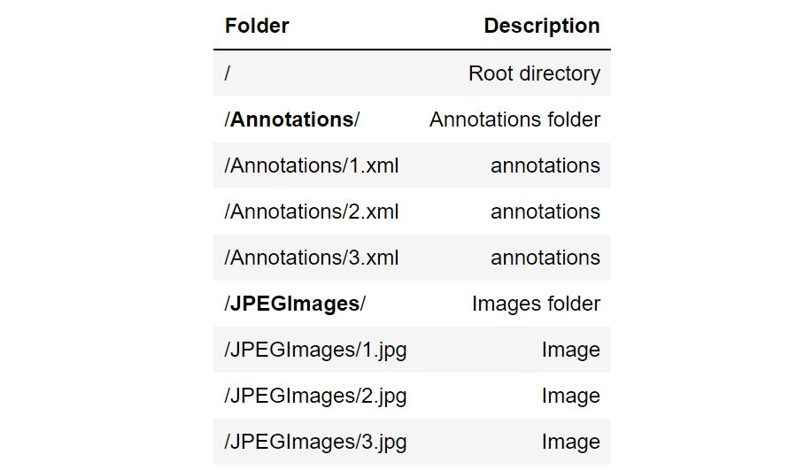
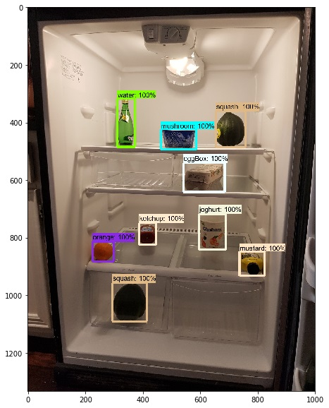
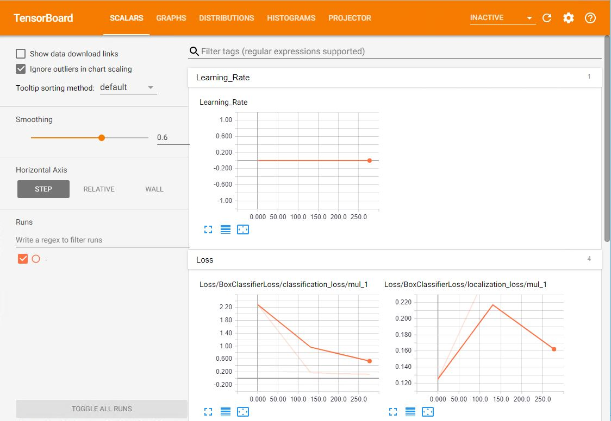
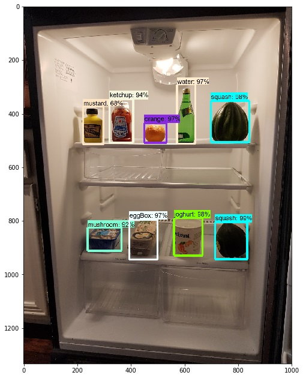

# Build and deploy object detection models with Azure Machine Learning

In this article, learn how to use **Azure Machine Learning Package for Computer Vision** to train, test, and deploy a [Faster R-CNN](https://arxiv.org/abs/1506.01497) object detection model. 

A large number of problems in the computer vision domain can be solved using object detection. These problems include building models that find a variable number of objects on an image. 

When building and deploying this model with this package, you go through the following steps:
1.	Dataset Creation
2.	Deep Neural Network (DNN) Model Definition
3.	Model Training
4.	Evaluation and Visualization
5.	Web service Deployment
6.	Web service Load Testing

In this example, TensorFlow is used as the deep learning framework, training is performed locally on a GPU powered machine such as the [Deep learning Data Science VM](https://azuremarketplace.microsoft.com/marketplace/apps/microsoft-ads.dsvm-deep-learning?tab=Overview), and deployment uses the Azure ML Operationalization CLI.

Consult the [package reference documentation](https://aka.ms/aml-packages/vision) for the detailed reference for each module and class.

## Prerequisites

1. If you don't have an Azure subscription, create a [free account](https://azure.microsoft.com/free/?WT.mc_id=A261C142F) before you begin.

1. The following accounts and application must be set up and installed:
   - An Azure Machine Learning Experimentation account 
   - An Azure Machine Learning Model Management account
   - Azure Machine Learning Workbench installed

   If these three are not yet created or installed, follow the [Azure Machine Learning Quickstart and Workbench installation](../service/quickstart-installation.md) article. 

1. The Azure Machine Learning Package for Computer Vision must be installed. Learn how to [install this package here](https://aka.ms/aml-packages/vision).

## Sample data and notebook

### Get the Jupyter notebook

Download the notebook to run the sample described here yourself.

> [!div class="nextstepaction"]
> [Get the Jupyter notebook](https://aka.ms/aml-packages/vision/notebooks/object_detection)

### Load the sample data

For this demo, a dataset of grocery items inside refrigerators is provided, consisting of 30 images and 8 classes (eggBox, joghurt, ketchup, mushroom, mustard, orange, squash, and water). For each jpg image, there's an annotation xml-file with similar name. 

The following figure shows the recommended folder structure. 



## Image Annotation

Annotated object locations are required to train and evaluate an object detector. [LabelImg](https://tzutalin.github.io/labelImg) is an open source annotation tool that can be used to annotate images. LabelImg writes an xml-file per image in Pascal-VOC format, which can be read by this package. 


```python
import warnings
warnings.filterwarnings("ignore")
import os, time
from cvtk.core import Context, ObjectDetectionDataset, TFFasterRCNN
from cvtk.evaluation import DetectionEvaluation
from cvtk.evaluation.evaluation_utils import graph_error_counts
from cvtk.utils import detection_utils

# Disable printing of logging messages
from azuremltkbase.logging import ToolkitLogger
ToolkitLogger.getInstance().setEnabled(False)

from matplotlib import pyplot as plt
# Display the images
%matplotlib inline
```

## Create a dataset

Create a CVTK dataset that consists of a set of images, with their respective bounding box annotations. In this example, the refrigerator images that are provided in the "../sample_data/foods/training" folder are used. Only JPEG images are supported.


```python
image_folder = "detection/sample_data/foods/train"
data_train = ObjectDetectionDataset.create_from_dir(dataset_name='training_dataset', data_dir=image_folder,
                                                    annotations_dir="Annotations", image_subdirectory='JPEGImages')

# Show some statistics of the training image, and also give one example of the ground truth rectangle annotations
data_train.print_info()
_ = data_train.images[2].visualize_bounding_boxes(image_size = (10,10))
```

    F1 2018-05-25 23:12:21,727 INFO azureml.vision:machine info {"is_dsvm": true, "os_type": "Windows"} 
    F1 2018-05-25 23:12:21,733 INFO azureml.vision:dataset creating dataset for scenario=detection 
    Dataset name: training_dataset
    Total classes: 8, total images: 25
    Label-wise object counts:
    	Label eggBox: 20 objects
    	Label joghurt: 20 objects
    	Label ketchup: 20 objects
    	Label mushroom: 20 objects
    	Label mustard: 20 objects
    	Label orange: 20 objects
    	Label squash: 40 objects
    	Label water: 20 objects
    Bounding box width and height distribution:
    	Bounding box widths  0/5/25/50/75/95/100-percentile: 54/61/79/117/133/165/311 pixels
    	Bounding box heights 0/5/25/50/75/95/100-percentile: 48/58/75/124/142/170/212 pixels
    





## Define a model

In this example, the Faster R-CNN model is used. Various parameters can be provided when defining this model. The meaning of these parameters, as well as the parameters used for training (see next section) can be found in either CVTK's API docs, or on the [Tensorflow object detection website](https://github.com/tensorflow/models/tree/master/research/object_detection). More information about Faster R-CNN model can be found at [this link](https://docs.microsoft.com/en-us/cognitive-toolkit/Object-Detection-using-Faster-R-CNN#technical-details). This model is based on Fast R-CNN and more information about it can be found [here](https://docs.microsoft.com/en-us/cognitive-toolkit/Object-Detection-using-Fast-R-CNN#algorithm-details).


```python
score_threshold = 0.0       # Threshold on the detection score, use to discard lower-confidence detections.
max_total_detections = 300  # Maximum number of detections. A high value slows down training but might increase accuracy.
my_detector = TFFasterRCNN(labels=data_train.labels, 
                           score_threshold=score_threshold, 
                           max_total_detections=max_total_detections)
```

## Train the model

The COCO-trained Faster R-CNN model with ResNet50 is used as the starting point for training. 

To train the detector, the number of training steps in the code is set to 350, so that training runs more quickly (~5 minutes with GPU). In practice, set it to at least 10 times the number of images in the training set.

In this example, the number of detector training steps is set to 350 for speedy training. However, in practice, a good rule of thumb is to set the steps to 10 or more times the number of images in the training set.

Two key parameters for training are:
- Number of steps to train the model, represented by the num_seps argument. Each step trains the model with a minibatch of batch size one.
- Learning rate(s), which can be set by initial_learning_rate

```python
print("tensorboard --logdir={}".format(my_detector.train_dir))

# to get good results, use a larger value for num_steps, e.g., 5000.
num_steps = 350
learning_rate = 0.001 # learning rate

start_train = time.time()
my_detector.train(dataset=data_train, num_steps=num_steps, 
                  initial_learning_rate=learning_rate)
end_train = time.time()
print(end_train-start_train)
```

    tensorboard --logdir=C:\Users\lixun\Desktop\AutoDL\CVTK\Src\API\cvtk_output\temp_faster_rcnn_resnet50\models\train
    F1 2018-05-25 23:12:22,764 INFO azureml.vision:Fit starting in experiment  1125722225 
    F1 2018-05-25 23:12:22,767 INFO azureml.vision:model starting trainging for scenario=detection 
    Using existing checkpoint file that's saved at 'C:\Users\lixun\Desktop\AutoDL\CVTK\Src\API\cvtk_output\models\detection\faster_rcnn_resnet50_coco_2018_01_28\model.ckpt.index'.
    TFRecords creation started.
    F1 2018-05-25 23:12:22,773 INFO On image 0 of 25
    TFRecords creation completed.
    Training started.
    Training progressing: step 0 ...
    Training progressing: step 100 ...
    Training progressing: step 200 ...
    Training progressing: step 300 ...
    F1 2018-05-25 23:18:02,730 INFO Graph Rewriter optimizations enabled
    Converted 275 variables to const ops.
    F1 2018-05-25 23:18:10,722 INFO 2953 ops in the final graph.
    F1 2018-05-25 23:18:24,244 INFO azureml.vision:Fit finished in experiment  1125722225 
    Training completed.
    361.604615688324
    

TensorBoard can be used to visualize the training progress. TensorBoard events are located in the folder specified by the model object's train_dir attribute. To view TensorBoard, follow these steps:
1. Copy the printout that starts with 'tensorboard --logdir' to a command line and run it. 
2. Copy the returned URL from the command line to a web browser to view the TensorBoard. 

The TensorBoard should look like the following screenshot. It takes a few moments for the training folder to be populated. So if TensorBoard does not show up correctly the first time try repeating steps 1-2.  



## Evaluate the model

The 'evaluate' method is used to evaluate the model. This function requires an ObjectDetectionDataset object as an input. The evaluation dataset can be created using the same function as the one used for the training dataset. The supported metric is Average Precision as defined for the [PASCAL VOC Challenge](http://host.robots.ox.ac.uk/pascal/VOC/pubs/everingham10.pdf).  


```python
image_folder = "detection/sample_data/foods/test"
data_val = ObjectDetectionDataset.create_from_dir(dataset_name='val_dataset', data_dir=image_folder)
eval_result = my_detector.evaluate(dataset=data_val)
```

    F1 2018-05-25 23:18:24,253 INFO azureml.vision:dataset creating dataset for scenario=detection 
    F1 2018-05-25 23:18:24,286 INFO On image 0 of 5
    F1 2018-05-25 23:18:29,300 INFO Starting evaluation at 2018-05-26-03:18:29
    F1 2018-05-25 23:18:32,403 INFO Creating detection visualizations.
    F1 2018-05-25 23:18:33,158 INFO Detection visualizations written to summary with tag image-0.
    F1 2018-05-25 23:18:33,518 INFO Creating detection visualizations.
    F1 2018-05-25 23:18:34,342 INFO Detection visualizations written to summary with tag image-1.
    F1 2018-05-25 23:18:34,714 INFO Creating detection visualizations.
    F1 2018-05-25 23:18:35,470 INFO Detection visualizations written to summary with tag image-2.
    F1 2018-05-25 23:18:35,835 INFO Creating detection visualizations.
    F1 2018-05-25 23:18:36,654 INFO Detection visualizations written to summary with tag image-3.
    F1 2018-05-25 23:18:37,010 INFO Creating detection visualizations.
    F1 2018-05-25 23:18:37,798 INFO Detection visualizations written to summary with tag image-4.
    F1 2018-05-25 23:18:37,804 INFO Running eval batches done.
    F1 2018-05-25 23:18:37,805 INFO # success: 5
    F1 2018-05-25 23:18:37,806 INFO # skipped: 0
    F1 2018-05-25 23:18:38,119 INFO Writing metrics to tf summary.
    F1 2018-05-25 23:18:38,121 INFO PASCAL/PerformanceByCategory/AP@0.5IOU/eggBox: 1.000000
    F1 2018-05-25 23:18:38,205 INFO PASCAL/PerformanceByCategory/AP@0.5IOU/joghurt: 0.942857
    F1 2018-05-25 23:18:38,206 INFO PASCAL/PerformanceByCategory/AP@0.5IOU/ketchup: 1.000000
    F1 2018-05-25 23:18:38,207 INFO PASCAL/PerformanceByCategory/AP@0.5IOU/mushroom: 1.000000
    F1 2018-05-25 23:18:38,208 INFO PASCAL/PerformanceByCategory/AP@0.5IOU/mustard: 1.000000
    F1 2018-05-25 23:18:38,209 INFO PASCAL/PerformanceByCategory/AP@0.5IOU/orange: 1.000000
    F1 2018-05-25 23:18:38,210 INFO PASCAL/PerformanceByCategory/AP@0.5IOU/squash: 1.000000
    F1 2018-05-25 23:18:38,211 INFO PASCAL/PerformanceByCategory/AP@0.5IOU/water: 1.000000
    F1 2018-05-25 23:18:38,211 INFO PASCAL/Precision/mAP@0.5IOU: 0.992857
    F1 2018-05-25 23:18:38,253 INFO Metrics written to tf summary.
    F1 2018-05-25 23:18:38,254 INFO Finished evaluation!
    

The evaluation results can be printed out in a clean format.


```python
# print out the performance metric values
for label_obj in data_train.labels:
    label = label_obj.name
    key = 'PASCAL/PerformanceByCategory/AP@0.5IOU/' + label
    print('{0: <15}: {1: <3}'.format(label, round(eval_result[key], 2)))
print('{0: <15}: {1: <3}'.format("overall:", round(eval_result['PASCAL/Precision/mAP@0.5IOU'], 2))) 
```

    joghurt        : 0.94
    squash         : 1.0
    mushroom       : 1.0
    eggBox         : 1.0
    ketchup        : 1.0
    mustard        : 1.0
    water          : 1.0
    orange         : 1.0
    overall:       : 0.99
    

Similarly, you can compute the accuracy of the model on the training set. Doing this helps make sure training converged to a good solution. The accuracy on the training set after successful training is often close to 100%.

Evaluation results can also be viewed from TensorBoard, including mAP values and images with predicted bounding boxes. Copy the printout from the following code into a command line window to start the TensorBoard client. Here a port value 8008 is used to avoid conflict with the default value of 6006, which was using for viewing training status.


```python
print("tensorboard --logdir={} --port=8008".format(my_detector.eval_dir))
```

    tensorboard --logdir=C:\Users\lixun\Desktop\AutoDL\CVTK\Src\API\cvtk_output\temp_faster_rcnn_resnet50\models\eval --port=8008
    

## Score an image

Once you're satisfied with the performance of the trained model, the model object's 'score' function can be used to score new images. The returned scores can be visualized with the 'visualize' function . 


```python
image_path = data_val.images[1].storage_path
detections_dict = my_detector.score(image_path)
path_save = "./scored_images/scored_image_preloaded.jpg"
ax = detection_utils.visualize(image_path, detections_dict, image_size=(8, 12))
path_save_dir = os.path.dirname(os.path.abspath(path_save))
os.makedirs(path_save_dir, exist_ok=True)
ax.get_figure().savefig(path_save)
```


##  Save the model

The trained model can be saved to disk, and loaded back into memory, as shown in the following code examples.


```python
save_model_path = "./frozen_model/faster_rcnn.model"
my_detector.save(save_model_path)
```

    F1 2018-05-25 23:18:55,166 INFO Graph Rewriter optimizations enabled
    Converted 275 variables to const ops.
    F1 2018-05-25 23:19:03,867 INFO 2953 ops in the final graph.
    

## Load the saved model for scoring

To use the saved model, load the model into memory with the 'load' function. You only need to load once. 

```python
my_detector_loaded = TFFasterRCNN.load(save_model_path)
```

After the model is loaded, it can be used to score an image or a list of images. For a single image, a dictionary is returned with keys such as 'detection_boxes', 'detection_scores', and 'num_detections'. If the input is a list of images, a list of dictionary is returned, with one dictionary corresponding to one image. 


```python
detections_dict = my_detector_loaded.score(image_path)
```

The detected objects with scores above 0.5, including labels, scores, and coordinates can be printed out.


```python
look_up = dict((v,k) for k,v in my_detector.class_map.items())
n_obj = 0
for i in range(detections_dict['num_detections']):
    if detections_dict['detection_scores'][i] > 0.5:
        n_obj += 1
        print("Object {}: label={:11}, score={:.2f}, location=(top: {:.2f}, left: {:.2f}, bottom: {:.2f}, right: {:.2f})".format(
            i, look_up[detections_dict['detection_classes'][i]], 
            detections_dict['detection_scores'][i], 
            detections_dict['detection_boxes'][i][0],
            detections_dict['detection_boxes'][i][1], 
            detections_dict['detection_boxes'][i][2],
            detections_dict['detection_boxes'][i][3]))    
        
print("\nFound {} objects in image {}.".format(n_obj, image_path))           
```

    Object 0: label=squash     , score=0.99, location=(top: 0.74, left: 0.30, bottom: 0.84, right: 0.42)
    Object 1: label=squash     , score=0.98, location=(top: 0.27, left: 0.21, bottom: 0.37, right: 0.33)
    Object 2: label=orange     , score=0.98, location=(top: 0.31, left: 0.39, bottom: 0.37, right: 0.48)
    Object 3: label=joghurt    , score=0.98, location=(top: 0.57, left: 0.29, bottom: 0.67, right: 0.39)
    Object 4: label=eggBox     , score=0.97, location=(top: 0.41, left: 0.53, bottom: 0.49, right: 0.69)
    Object 5: label=water      , score=0.95, location=(top: 0.23, left: 0.51, bottom: 0.37, right: 0.57)
    Object 6: label=mustard    , score=0.88, location=(top: 0.61, left: 0.47, bottom: 0.66, right: 0.57)
    Object 7: label=ketchup    , score=0.80, location=(top: 0.62, left: 0.62, bottom: 0.68, right: 0.72)
    
    Found 8 objects in image ../sample_data/foods/test\JPEGImages\10.jpg.
    

Visualize the scores just like before.


```python
path_save = "./scored_images/scored_image_frozen_graph.jpg"
ax = detection_utils.visualize(image_path, detections_dict, path_save=path_save, image_size=(8, 12))
# ax.get_figure() # use this code extract the returned image
```



## Operationalization: deploy and consume

Operationalization is the process of publishing models and code as web services and the consumption of these services to produce business results. 

Once your model is trained, you can deploy that model as a web service for consumption using [Azure Machine Learning CLI](https://docs.microsoft.com/azure/machine-learning/desktop-workbench/cli-for-azure-machine-learning). Your models can be deployed to your local machine or Azure Container Service (ACS) cluster. Using ACS, you can scale your web service manually or use the autoscaling functionality.

**Sign in with Azure CLI**

Using an [Azure](https://azure.microsoft.com/) account with a valid subscription, log in using the following CLI command:
<br>`az login`

+ To switch to another Azure subscription, use the command:
<br>`az account set --subscription [your subscription name]`

+ To see the current model management account, use the command:
  <br>`az ml account modelmanagement show`

**Create and set your cluster deployment environment**

You only need to set your deployment environment once. If you don't have one yet, set up your deployment environment now using [these instructions](https://docs.microsoft.com/azure/machine-learning/desktop-workbench/deployment-setup-configuration#environment-setup). 

To see your active deployment environment, use the following CLI command:
<br>`az ml env show`
   
Sample Azure CLI command to create and set deployment environment

```CLI
az provider register -n Microsoft.MachineLearningCompute
az provider register -n Microsoft.ContainerRegistry
az provider register -n Microsoft.ContainerService
az ml env setup --cluster -n [your environment name] -l [Azure region e.g. westcentralus] [-g [resource group]]
az ml env set -n [environment name] -g [resource group]
az ml env cluster
```
    
### Manage web services and deployments

The following APIs can be used to deploy models as web services, manage those web services, and manage deployments.

|Task|API|
|----|----|
|Create deployment object|`deploy_obj = AMLDeployment(deployment_name=deployment_name, associated_DNNModel=dnn_model, aml_env="cluster")`
|Deploy web service|`deploy_obj.deploy()`|
|Score image|`deploy_obj.score_image(local_image_path_or_image_url)`|
|Delete web service|`deploy_obj.delete()`|
|Build docker image without web service|`deploy_obj.build_docker_image()`|
|List existing deployment|`AMLDeployment.list_deployment()`|
|Delete if the service exists with the deployment name|`AMLDeployment.delete_if_service_exist(deployment_name)`|

**API documentation:** Consult the [package reference documentation](https://aka.ms/aml-packages/vision) for the detailed reference for each module and class.

**CLI reference:** For more advanced operations related to deployment, refer to the [model management CLI reference](https://docs.microsoft.com/azure/machine-learning/desktop-workbench/model-management-cli-reference).

**Deployment management in Azure portal**: You can track and manage your deployments in the [Azure portal](https://ms.portal.azure.com/). From the Azure portal, find your Machine Learning Model Management account page using its name. Then go to the Model Management account page > Model Management > Services.

```python
# ##### OPTIONAL - Interactive CLI setup helper ###### 
# # Interactive CLI setup helper, including model management account and deployment environment.
# # If you haven't setup you CLI before or if you want to change you CLI settings, you can use this block to help you interactively.
# # UNCOMMENT THE FOLLOWING LINES IF YOU HAVE NOT CREATED OR SET THE MODEL MANAGEMENT ACCOUNT AND DEPLOYMENT ENVIRONMENT

# from azuremltkbase.deployment import CliSetup
# CliSetup().run()
```


```python
from cvtk.operationalization import AMLDeployment

# set deployment name
deployment_name = "wsdeployment"

# Create deployment object
# It will use the current deployment environment (you can check it with CLI command "az ml env show").
deploy_obj = AMLDeployment(deployment_name=deployment_name, aml_env="cluster", associated_DNNModel=my_detector, replicas=1)

# Alternatively, you can provide azure machine learning deployment cluster name (environment name) and resource group name
# to deploy your model. It will use the provided cluster to deploy. To do that, please uncomment the following lines to create 
# the deployment object.

# azureml_rscgroup = "<resource group>"
# cluster_name = "<cluster name>"
# deploy_obj = AMLDeployment(deployment_name=deployment_name, associated_DNNModel=my_detector,
#                            aml_env="cluster", cluster_name=cluster_name, resource_group=azureml_rscgroup, replicas=1)

# Check if the deployment name exists, if yes remove it first.
if deploy_obj.is_existing_service():
    AMLDeployment.delete_if_service_exist(deployment_name)
    
# create the webservice
print("Deploying to Azure cluster...")
deploy_obj.deploy()
print("Deployment DONE")
```

### Consume the web service

Once you created the webservice, you can score images with the deployed webservice. You have several options:

   - You can directly score the webservice with the deployment object with: deploy_obj.score_image(image_path_or_url) 
   - Or, you can use the Service endpoint url and Service key (None for local deployment) with: AMLDeployment.score_existing_service_with_image(image_path_or_url, service_endpoint_url, service_key=None)
   - Form your http requests directly to score the webservice endpoint (For advanced users).

### Score with existing deployment object
```
deploy_obj.score_image(image_path_or_url)
```


```python
# Score with existing deployment object

# Score local image with file path
print("Score local image with file path")
image_path_or_url = data_train.images[0].storage_path
print("Image source:",image_path_or_url)
serialized_result_in_json = deploy_obj.score_image(image_path_or_url, image_resize_dims=[224,224])
print("serialized_result_in_json:", serialized_result_in_json[:50])

# Score image url and remove image resizing
print("Score image url")
image_path_or_url = "https://cvtkdata.blob.core.windows.net/publicimages/microsoft_logo.jpg"
print("Image source:",image_path_or_url)
serialized_result_in_json = deploy_obj.score_image(image_path_or_url)
print("serialized_result_in_json:", serialized_result_in_json[:50])

```


```python
# Time image scoring
import timeit

num_images = 3
for img_index, img_obj in enumerate(data_train.images[:num_images]):
    print("Calling API for image {} of {}: {}...".format(img_index, num_images, img_obj.name))
    tic = timeit.default_timer()
    return_json = deploy_obj.score_image(img_obj.storage_path, image_resize_dims=[224,224])
    print("   Time for API call: {:.2f} seconds".format(timeit.default_timer() - tic))
```

### Score with service endpoint url and service key
```
    AMLDeployment.score_existing_service_with_image(image_path_or_url, service_endpoint_url, service_key=None)
```


```python
# Import related classes and functions
from cvtk.operationalization import AMLDeployment

service_endpoint_url = "http://xxx" # please replace with your own service url
service_key = "xxx" # please replace with your own service key

# score image url
image_path_or_url = "https://cvtkdata.blob.core.windows.net/publicimages/microsoft_logo.jpg"
print("Image source:",image_path_or_url)
serialized_result_in_json = AMLDeployment.score_existing_service_with_image(image_path_or_url,service_endpoint_url, service_key = service_key, image_resize_dims=[224,224])
print("serialized_result_in_json:", serialized_result_in_json[:50])
```

### Score endpoint with http request directly
Following is some example code to form the http request directly in Python. You can do it in other programming languages.


```python
def score_image_with_http(image, service_endpoint_url, service_key=None, parameters={}):
    """Score local image with http request

    Args:
        image (str): Image file path
        service_endpoint_url(str): web service endpoint url
        service_key(str): Service key. None for local deployment.
        parameters (dict): Additional request paramters in dictionary. Default is {}.


    Returns:
        str: serialized result 
    """
    import requests
    from io import BytesIO
    import base64
    import json

    if service_key is None:
        headers = {'Content-Type': 'application/json'}
    else:
        headers = {'Content-Type': 'application/json',
                   "Authorization": ('Bearer ' + service_key)}
    payload = []
    encoded = None
    
    # Read image
    with open(image,'rb') as f:
        image_buffer = BytesIO(f.read()) ## Getting an image file represented as a BytesIO object
        
    # Convert your image to base64 string
    # image_in_base64 : "b'{base64}'"
    encoded = base64.b64encode(image_buffer.getvalue())
    image_request = {"image_in_base64": "{0}".format(encoded), "parameters": parameters}
    payload.append(image_request)
    body = json.dumps(payload)
    r = requests.post(service_endpoint_url, data=body, headers=headers)
    try:
        result = json.loads(r.text)
        json.loads(result[0])
    except:
        raise ValueError("Incorrect output format. Result cant not be parsed: " + r.text)
    return result[0]

```

### Parse serialized result from webservice
The result from the web service is in json string that can be parsed.


```python
image_path_or_url = image_path
print("Image source:",image_path_or_url)
serialized_result_in_json = deploy_obj.score_image(image_path_or_url)
print("serialized_result_in_json:", serialized_result_in_json[:50])
```


```python
# Parse result from json string
import numpy as np
parsed_result = TFFasterRCNN.parse_serialized_result(serialized_result_in_json)
print("Parsed result:", parsed_result)
```


```python
ax = detection_utils.visualize(image_path, parsed_result)
path_save = "./scored_images/scored_image_web.jpg"
path_save_dir = os.path.dirname(os.path.abspath(path_save))
os.makedirs(path_save_dir, exist_ok=True)
ax.get_figure().savefig(path_save)
```

## Next steps

Learn more about Azure Machine Learning Package for Computer Vision in these articles:

+ Read the [package overview and learn how to install it](https://aka.ms/aml-packages/vision).

+ Explore the [reference documentation](https://docs.microsoft.com/python/api/overview/azure-machine-learning/computer-vision) for this package.

+ Learn about [other Python packages for Azure Machine Learning](reference-python-package-overview.md).
