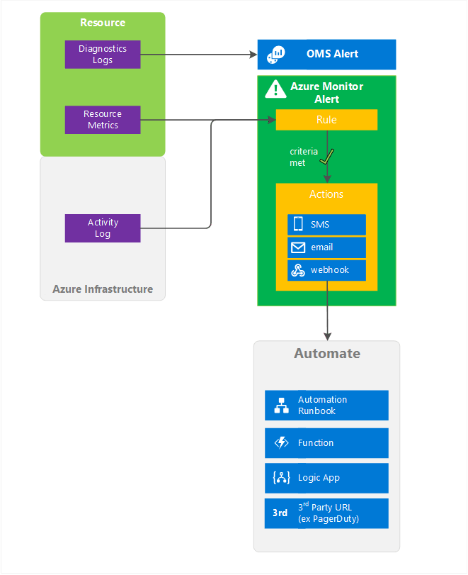

# What are classic alerts in Microsoft Azure?

> [!NOTE]
> This article describes how to create older, classic metric alerts. Azure Monitor now supports [newer, near-real time metric alerts, and a new alerts experience](monitoring-overview-unified-alerts.md). 
>

By using alerts, you can configure conditions over data and get notified when the conditions match the latest monitoring data.

## Alerts on Azure Monitor data
There are two types of classic alerts available: metric alerts and activity log alerts.

* **Classic metric alerts**: This alert triggers when the value of a specified metric crosses a threshold that you assign. The alert generates a notification when the it's "activated" (when the threshold is crossed and the alert condition is met). It also generates an alert when it is "resolved" (when the threshold is crossed again and the condition is no longer met). 

* **Classic activity log alerts**: This streaming log alert triggers when an activity log event is generated that matches filter criteria that you've assigned. These alerts have only one state, "activated," because the alert engine simply applies the filter criteria to any new event. These alerts can notify you when a new Service Health incident occurs or when a user or application performs an operation in your subscription such as "Delete virtual machine."

To receive diagnostic log data available that's available through Azure Monitor, route the data into Log Analytics (formerly Operations Management Suite) and use a Log Analytics query alert. Log Analytics now uses the [new alerting method](monitoring-overview-unified-alerts.md). 

The following diagram summarizes sources of data in Azure Monitor and suggests how you can alert off this data.

## Taxonomy of Azure Monitor alerts (classic)
Azure uses the following terms to describe classic alerts and their functions:
* **Alert**: The definition of criteria (one or more rules or conditions) that becomes activated when met.
* **Active**: The state that occurs when the criteria that's defined by a classic alert is met.
* **Resolved**: The state that occurs when the criteria that's defined by a classic alert is no longer met after previously having been met.
* **Notification**: The action that's taken based on when a classic alert becomes active.
* **Action**: The specific call that's sent to the receiver of a notification (for example, an email or a post to a webhook URL). Notifications can usually trigger multiple actions.

## How do I receive notifications from an Azure Monitor classic alert?
Historically, Azure alerts from different services used their own built-in notification methods. 

Now Azure Monitor offers reusable notification grouping called *action groups*. Action groups specify a set of receivers for a notification. When an alert is activated that references the action group, all receivers receive that notification. This functionality enables you to reuse a grouping of receivers (for example, your on-call engineer list) across many alert objects. Action groups support notification through various methods. These methods can include posting to a webhook URL, sending emails, SMS messages, and a number of other actions. For more information, see [Create and manage action groups in the Azure portal](monitoring-action-groups.md). 

Older classic activity log alerts use action groups.

However, the older metric alerts don't use action groups. Instead, you can configure the following actions: 
* Send email notifications to the service administrator, co-administrators, or to additional email addresses that you specify.
* Call a webhook, which enables you to launch additional automation actions.

Webhooks enable automation and remediation, for example, using the following services:
- Azure Automation Runbook
- Azure Functions
- Azure Logic App
- A third-party service

## Next steps
Get information about alert rules and how to configure them by using the following documentation:

* Learn more about [metrics](monitoring-overview-metrics.md)
* Configure [classic metric alerts by using the Azure portal](insights-alerts-portal.md)
* Configure [classic metric alerts by using PowerShell](insights-alerts-powershell.md)
* Configure [classic metric alerts by using the Azure CLI](insights-alerts-command-line-interface.md)
* Configure [classic metric alerts by using the Azure Monitor REST API](https://msdn.microsoft.com/library/azure/dn931945.aspx)
* Learn more about [activity logs](monitoring-overview-activity-logs.md)
* Configure [activity log alerts by using the Azure portal](monitoring-activity-log-alerts.md)
* Configure [activity log alerts by using Resource Manager](monitoring-create-activity-log-alerts-with-resource-manager-template.md)
* Review the [activity log alert webhook schema](monitoring-activity-log-alerts-webhook.md)
* Learn more about [action groups](monitoring-action-groups.md)
* Configure [newer alerts](monitor-alerts-unified-usage.md)
