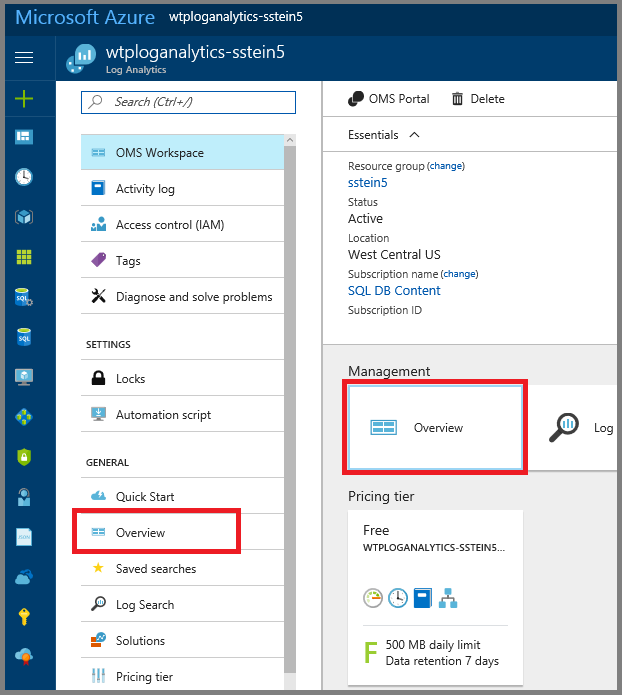
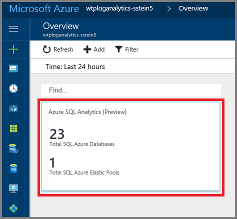
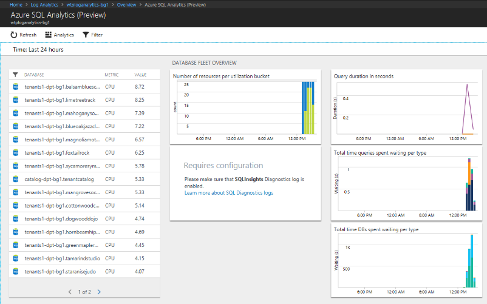
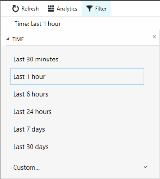
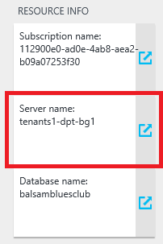
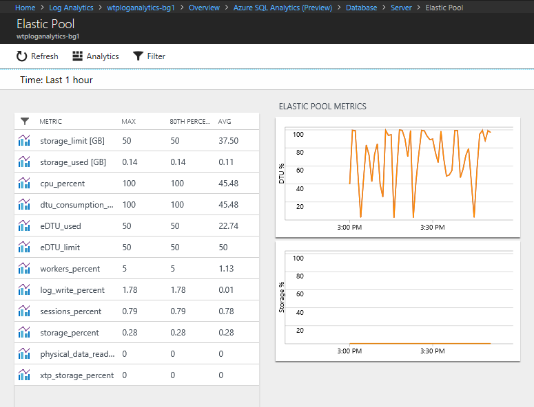

# Set up and use Log Analytics with a multitenant SQL Database SaaS app

In this tutorial, you set up and use Azure [Log Analytics](/azure/log-analytics/log-analytics-overview) to monitor elastic pools and databases. This tutorial builds on the [Performance monitoring and management tutorial](saas-dbpertenant-performance-monitoring.md). It shows how to use Log Analytics to augment the monitoring and alerting provided in the Azure portal. Log Analytics supports monitoring thousands of elastic pools and hundreds of thousands of databases. Log Analytics provides a single monitoring solution, which can integrate monitoring of different applications and Azure services across multiple Azure subscriptions.

In this tutorial you learn how to:

> [!div class="checklist"]
> * Install and configure Log Analytics.
> * Use Log Analytics to monitor pools and databases.

To complete this tutorial, make sure the following prerequisites are completed:

* The Wingtip Tickets SaaS database-per-tenant app is deployed. To deploy in less than five minutes, see [Deploy and explore the Wingtip Tickets SaaS database-per-tenant application](saas-dbpertenant-get-started-deploy.md).
* Azure PowerShell is installed. For more information, see [Get started with Azure PowerShell](https://docs.microsoft.com/powershell/azure/get-started-azureps).

See the [Performance monitoring and management tutorial](saas-dbpertenant-performance-monitoring.md) for a discussion of SaaS scenarios and patterns and how they affect the requirements on a monitoring solution.

## Monitor and manage database and elastic pool performance with Log Analytics

For Azure SQL Database, monitoring and alerting is available on databases and pools in the Azure portal. This built-in monitoring and alerting is convenient, but it's also resource-specific. That means it's less well suited to monitor large installations or provide a unified view across resources and subscriptions.

For high-volume scenarios, you can use Log Analytics for monitoring and alerting. Log Analytics is a separate Azure service that enables analytics over diagnostic logs and telemetry that's gathered in a workspace from potentially many services. Log Analytics provides a built-in query language and data visualization tools that allow operational data analytics. The SQL Analytics solution provides several predefined elastic pool and database monitoring and alerting views and queries. Log Analytics also provides a custom view designer.

Log Analytics workspaces and analytics solutions open in the Azure portal and in Operations Management Suite. The Azure portal is the newer access point, but it might be behind the Operations Management Suite portal in some areas.

### Create performance diagnostic data by simulating a workload on your tenants 

1. In the PowerShell ISE, open *..\\WingtipTicketsSaaS-MultiTenantDb-master\\Learning Modules\\Performance Monitoring and Management\\Demo-PerformanceMonitoringAndManagement.ps1*. Keep this script open because you might want to run several of the load generation scenarios during this tutorial.
1. If you haven't done so already, provision a batch of tenants to make the monitoring context more interesting. This process takes a few minutes.

   a. Set **$DemoScenario = 1**, _Provision a batch of tenants_.

   b. To run the script and deploy an additional 17 tenants, press F5.

1. Now start the load generator to run a simulated load on all the tenants.

    a. Set **$DemoScenario = 2**, _Generate normal intensity load (approx. 30 DTU)_.

    b. To run the script, press F5.

## Get the Wingtip Tickets SaaS database-per-tenant application scripts

The Wingtip Tickets SaaS multitenant database scripts and application source code are available in the [WingtipTicketsSaaS-DbPerTenant](https://github.com/Microsoft/WingtipTicketsSaaS-DbPerTenant) GitHub repo. For steps to download and unblock the Wingtip Tickets PowerShell scripts, see the [general guidance](saas-tenancy-wingtip-app-guidance-tips.md).

## Install and configure Log Analytics and the Azure SQL Analytics solution

Log Analytics is a separate service that must be configured. Log Analytics collects log data, telemetry, and metrics in a Log Analytics workspace. Just like other resources in Azure, a Log Analytics workspace must be created. The workspace doesn't need to be created in the same resource group as the applications it monitors. Doing so often makes the most sense though. For the Wingtip Tickets app, use a single resource group to make sure the workspace is deleted with the application.

1. In the PowerShell ISE, open *..\\WingtipTicketsSaaS-MultiTenantDb-master\\Learning Modules\\Performance Monitoring and Management\\Log Analytics\\Demo-LogAnalytics.ps1*.
1. To run the script, press F5.

Now you can open Log Analytics in the Azure portal or the Operations Management Suite portal. It takes a few minutes to collect telemetry in the Log Analytics workspace and to make it visible. The longer you leave the system gathering diagnostic data, the more interesting the experience is. 

## Use Log Analytics and the SQL Analytics solution to monitor pools and databases

In this exercise, open Log Analytics and the Operations Management Suite portal to look at the telemetry gathered for the databases and pools.

1. Browse to the [Azure portal](https://portal.azure.com). Select **All services** to open Log Analytics. Then search for Log Analytics.

   

1. Select the workspace named _wtploganalytics-&lt;user&gt;_.

1. Select **Overview** to open the Log Analytics solution in the Azure portal.

   

    > [!IMPORTANT]
    > It might take a couple of minutes before the solution is active. 

1. Select the **Azure SQL Analytics** tile to open it.

    

1. The views in the solution scroll sideways, with their own inner scroll bar at the bottom. Refresh the page if necessary.

1. To explore the summary page, select the tiles or individual databases to open a drill-down explorer.

    

1. Change the filter setting to modify the time range. For this tutorial, select **Last 1 hour**.

    

1. Select a single database to explore the query usage and metrics for that database.

    

1. To see usage metrics, scroll the analytics page to the right.
 
     

1. Scroll the analytics page to the left, and select the server tile in the **Resource Info** list.  

    

    A page opens that shows the pools and databases on the server.

    

1. Select a pool. On the pool page that opens, scroll to the right to see the pool metrics. 

    

1. Back in the Log Analytics workspace, select **OMS Portal** to open the workspace there.

    

In the Operations Management Suite portal, you can explore the log and metric data in the workspace further. 

Monitoring and alerting in Log Analytics are based on queries over the data in the workspace, unlike the alerting defined on each resource in the Azure portal. By basing alerts on queries, you can define a single alert that looks over all databases, rather than defining one per database. Queries are limited only by the data available in the workspace.

For more information on how to use Log Analytics to query and set alerts, see [Work with alert rules in Log Analytics](https://docs.microsoft.com/azure/log-analytics/log-analytics-alerts-creating).

Log Analytics for SQL Database charges based on the data volume in the workspace. In this tutorial, you created a free workspace, which is limited to 500 MB per day. After that limit is reached, data is no longer added to the workspace.

## Next steps

In this tutorial you learned how to:

> [!div class="checklist"]
> * Install and configure Log Analytics.
> * Use Log Analytics to monitor pools and databases.

Try the [Tenant analytics tutorial](saas-dbpertenant-log-analytics.md).

## Additional resources

* [Additional tutorials that build on the initial Wingtip Tickets SaaS database-per-tenant application deployment](saas-dbpertenant-wingtip-app-overview.md#sql-database-wingtip-saas-tutorials)
* [Azure Log Analytics](../log-analytics/log-analytics-azure-sql.md)
