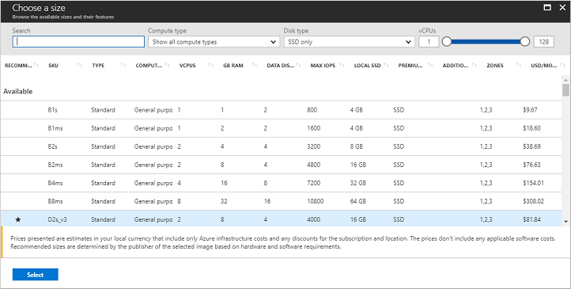

# Quickstart: Create a Windows virtual machine in the Azure portal

Azure virtual machines (VMs) can be created through the Azure portal. This method provides a browser-based user interface to create VMs and their associated resources. This quickstart shows you how to use the Azure portal to deploy a virtual machine (VM) in Azure that runs Windows Server 2016. To see your VM in action, you then RDP to the VM and install the IIS web server.

If you don't have an Azure subscription, create a [free account](https://azure.microsoft.com/free/?WT.mc_id=A261C142F) before you begin.

## Sign in to Azure

Sign in to the Azure portal at https://portal.azure.com.

## Create virtual machine

1. Choose **Create a resource** in the upper left-hand corner of the Azure portal.

2. In the search box above the list of Azure Marketplace resources, search for and select **Windows Server 2016 Datacenter**, then choose **Create**.

3. Provide a VM name, such as *myVM*, leave the disk type as *SSD*, then provide a username, such as *azureuser*. The password must be at least 12 characters long and meet the [defined complexity requirements](faq.md#what-are-the-password-requirements-when-creating-a-vm).

    

5. Choose to **Create new** resource group, then provide a name, such as *myResourceGroup*. Choose your **Location**, then select **OK**.

4. Select a size for the VM. You can filter by *Compute type* or *Disk type*, for example. A suggested VM size is *D2s_v3*. Click **Select** after you have chosen a size.

    

5. On the **Settings** page, in **Network** > **Network Security Group** > **Select public inbound ports**, select **HTTP** and **RDP (3389)** from the drop-down. Leave the rest of the defaults and select **OK**.

6. On the summary page, select **Create** to start the VM deployment.

7. The VM is pinned to the Azure portal dashboard. Once the deployment has completed, the VM summary automatically opens.

## Connect to virtual machine

Create a remote desktop connection to the virtual machine. These directions tell you how to connect to your VM from a Windows computer. On a Mac, you need an RDP client such as this [Remote Desktop Client](https://itunes.apple.com/us/app/microsoft-remote-desktop/id715768417?mt=12) from the Mac App Store.

1. Click the **Connect** button on the virtual machine properties page. 

    
	
2. In the **Connect to virtual machine** page, keep the default options to connect by DNS name over port 3389 and click **Download RDP file**.

2. Open the downloaded RDP file and click **Connect** when prompted. 

3. In the **Windows Security** window, select **More choices** and then **Use a different account**. Type the username as *vmname*\\*username*, enter password you created for the virtual machine, and then click **OK**.

4. You may receive a certificate warning during the sign-in process. Click **Yes** or **Continue** to create the connection.

## Install web server

To see your VM in action, install the IIS web server. Open a PowerShell prompt on the VM and run the following command:

```powershell
Install-WindowsFeature -name Web-Server -IncludeManagementTools
```

When done, close the RDP connection to the VM.


## View the IIS welcome page

In the portal, select the VM and in the overview of the VM, use the **Click to copy** button to the right of the IP address to copy it and paste it into a browser tab. The default IIS welcome page will open, and should look like this:


## Clean up resources

When no longer needed, you can delete the resource group, virtual machine, and all related resources. To do so, select the resource group for the virtual machine, select **Delete**, then confirm the name of the resource group to delete.

## Next steps

In this quickstart, you deployed a simple virtual machine, open a network port for web traffic, and installed a basic web server. To learn more about Azure virtual machines, continue to the tutorial for Windows VMs.

> [!div class="nextstepaction"]
> [Azure Windows virtual machine tutorials](./tutorial-manage-vm.md)
